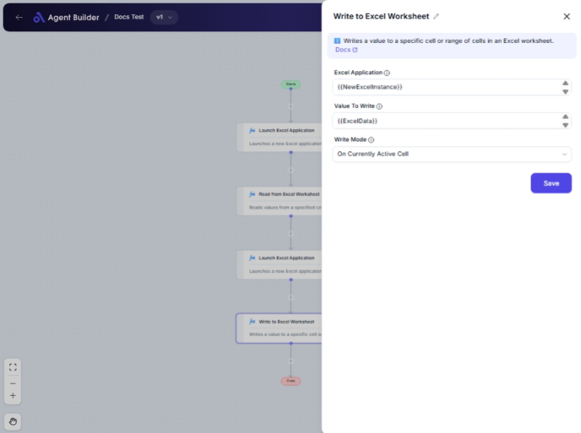

import { Callout, Steps } from "nextra/components";

# Write to Excel Worksheet

The **Write to Excel Worksheet** node enables you to automate data entry in an Excel sheet. Use this node to input values into specific cells or ranges within an Excel worksheet for organized data handling. It's especially useful for updating data in reports, dashboards, or spreadsheets without manual entry.

 

## Configuration Options

| Field Name                | Description                                                                                                           | Input Type | Required? | Default Value   |
| ------------------------- | --------------------------------------------------------------------------------------------------------------------- | ---------- | --------- | --------------- |
| **Excel Application**     | The Excel Application object containing the target worksheet.                                                         | Text       | Yes       | _(empty)_       |
| **Value To Write**        | The value to write into the specified cell or range.                                                                  | Text       | Yes       | _(empty)_       |
| **Write Mode**            | Specifies how to determine the target cell(s) for writing.                                                            | Select     | Yes       | OnSpecifiedCell |
| **Column**                | The column letter where the data should be written (e.g., 'A', 'B'). Required if 'Write Mode' is 'On Specified Cell'. | Text       | No        | _(empty)_       |
| **Row**                   | The row number where the data should be written. Required if 'Write Mode' is 'On Specified Cell'.                     | Text       | No        | _(empty)_       |
| **Name**                  | The name of the named range to write to. Required if 'Write Mode' is 'On Named Cells'.                                | Text       | No        | _(empty)_       |
| **Populate Entire Range** | If true, populates the entire named range with the same value. Applies solely to named ranges.                        | Switch     | No        | False           |

## Expected Output Format

The outcome of this node is not a direct data output. Instead, it reflects the successful modification of cell values in the Excel worksheet, performing a backend action.

## Step-by-Step Guide

<Steps>
### Step 1

Add **Write to Excel Worksheet** node into your flow.

### Step 2

In the **Excel Application** field, specify the Excel Application object that contains the worksheet where you want to write data.

### Step 3

Enter the data in the **Value To Write** field that you wish to insert into the Excel sheet.

### Step 4

Select the **Write Mode** to define how you want to target cells:

- **On Specified Cell**: Write by specifying exact column and row.
- **On Currently Active Cell**: Write to the cell currently in focus.
- **On Named Cells**: Write to cells defined by a named range.

### Step 5

If you choose **On Specified Cell**, fill in the **Column** and **Row** fields with the appropriate cell references.

### Step 6

If you select **On Named Cells**, enter the range in the **Name** field and decide if you'll use **Populate Entire Range** to fill the entire range with the entered value.

### Step 7

Run the flow to automatically write the specified values to your worksheet.

</Steps>

<Callout type="warning" title="Important">
  Ensure that the Excel Application object is correctly set up to avoid write
  errors.
</Callout>

## Input/Output Examples

- **Write Mode**: On Specified Cell

  - **Input**: Column `B`, Row `2`, Value `100`
  - **Action**: Writes `100` into cell `B2`.

- **Write Mode**: On Named Cells
  - **Input**: Name `SalesRange`, Value `75`, Populate Entire Range `true`
  - **Action**: Fills `SalesRange` with value `75`.

## Common Mistakes & Troubleshooting

| Problem                               | Solution                                                                                      |
| ------------------------------------- | --------------------------------------------------------------------------------------------- |
| **Cannot find the Excel Application** | Verify that the Excel application path and object are correctly set up.                       |
| **Write Mode options not appearing**  | Ensure you've selected the correct option in **Write Mode** that correlates with your intent. |
| **Populate Entire Range not working** | Confirm that you selected **On Named Cells** and correctly defined the named range.           |

## Real-World Use Cases

- **Sales Tracking**: Automatically log sales figures into an Excel dashboard for analytics.
- **Inventory Update**: Input inventory changes into a pre-defined spreadsheet cell to keep records current.
- **Financial Reports**: Insert financial data directly into reporting templates to maintain up-to-date reports.
