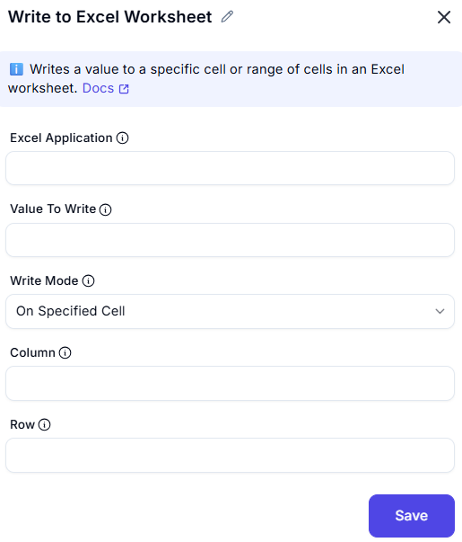

# Write to Excel Worksheet  

## Description
This feature allows users to write data to a specific cell or range in an Excel worksheet. It is useful for updating spreadsheets with new data during automation workflows.  

  

## Fields and Options  

### 1. Excel Application
- Select the Excel instance (workbook) where the data will be written.  
- This ensures the action is performed on the correct workbook.  

### 2. Value to Write
- Enter the data or value to write to the worksheet (e.g., text, numbers, formulas).  

### 3. Write Mode
- Choose where to write the data:  
  - **On currently active cell**: Write to the cell currently selected in the worksheet.  
  - **Specific cell**: Write to a cell defined by column and row.  

### 4. Column
- Specify the column where the data should be written (e.g., `A`, `B`, `1`, `2`).  

### 5. Row
- Specify the row where the data should be written (e.g., `1`, `2`, `10`).  

## Use Cases

- Updating specific cells in a worksheet with new data.  
- Automating data entry tasks in Excel.  
- Writing results or outputs from other processes into a spreadsheet.  

## Summary
The **Write to Excel Worksheet** action provides a way to write data to a specific cell or range in an Excel worksheet. It ensures precise control over where and how data is written, making it ideal for automation and data management tasks.  