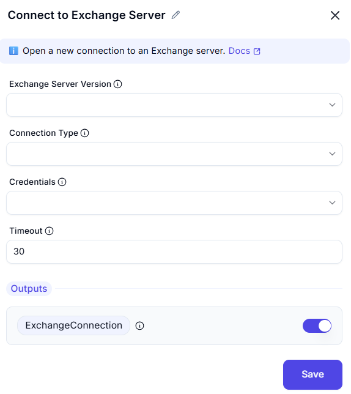

# Connect to Exchange Server

This interface allows users to **connect to an Exchange server** using specified settings, including Exchange server version, connection type, credentials, and timeout configuration.

---

##  Configuration Options

### Exchange Server Version
- Specifies the version of the Exchange server.
**Value:** `Exchange 2013 SP1`

### Connection Type
- Defines the method used to connect to the Exchange server.
**Value:** `Auto discovery`

### Email Address
- Specifies the **email address** to use for the connection.
**Value:** `user@example.com`

### Credentials
- Specifies the credentials used for authentication.
**Value:** `Exchange default`

### Timeout
- Defines the time (in seconds) before the connection attempt times out.
**Value:** `30`

---

## Output
- **ExchangeConnection** (Enabled)
Generates an **Exchange connection object** for later use in Exchange-related actions.

---

## Summary
This tool enables users to connect to an **Exchange Server** with configurable settings, including:
- **Exchange server version selection**
- **Auto discovery or manual connection setup**
- **Email authentication using credentials**
- **Timeout configuration**
- **Exchange connection object for further actions**