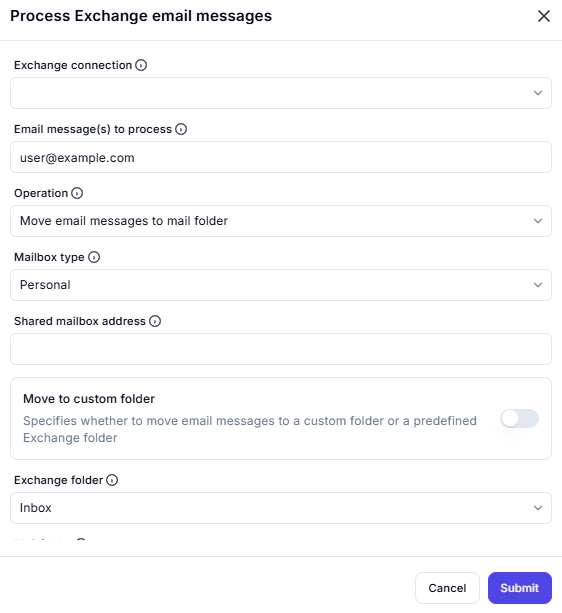

# Process Exchange Email Messages

## Description
This interface enables users to **process email messages** in an Exchange server by performing actions such as moving emails to folders.

---

## Fields and Options

### 1. Exchange Connection
- Select the **Exchange server connection** used for processing emails.

### 2. Email Message(s) to Process
- Specify the **email address** associated with the messages to be processed.
- **Example:** `user@example.com`

### 3. Operation
- Choose the action to perform on the email messages.
- **Example:** "Move email messages to mail folder".

### 4. Mailbox Type
- Select the type of mailbox:
  - **Personal**: The user's individual mailbox.
  - **Shared**: A shared mailbox used by multiple users.

### 5. Move to Custom Folder (Toggle)
- **Enable this option** if you want to move emails to a **custom folder** instead of a predefined Exchange folder.
---

## **Summary**
This tool allows users to:

- **Process emails** within an Exchange server.
- **Move messages** to different folders.
- **Handle personal or shared mailboxes**.
- **Customize folder locations** for processed emails.