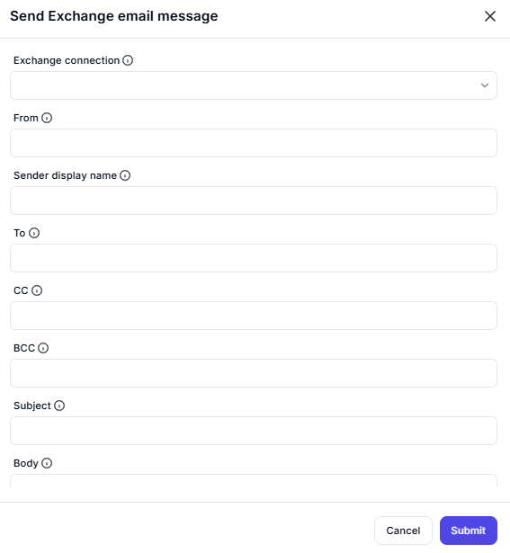

# Send Exchange Email Message

This interface enables users to **send emails via an Exchange server** by providing necessary details such as sender, recipient(s), subject, and body content.

---

## Configuration Options

### Exchange Connection
- Select the **Exchange server connection** for sending the email.

### From
- Specify the **sender’s email address**.

### Sender Display Name
- Define the **name that appears** to recipients instead of the email address.

### To
- Enter one or more **primary recipient(s)**.
**Example:** `user@example.com`

### CC (Carbon Copy)
- Add email addresses for **CC recipients**.
**Example:** `ccuser@example.com`

### BCC (Blind Carbon Copy)
- Add email addresses for **BCC recipients**.
**Example:** `bccuser@example.com`

### Subject
- Enter the **subject line** of the email.

### Body
- Input the **email message content**.

---

## Summary
This tool allows users to:
- **Send emails** using an Exchange server.
- **Specify multiple recipients** (To, CC, BCC).
- **Customize the sender’s display name**.
- **Include a subject and body message**.