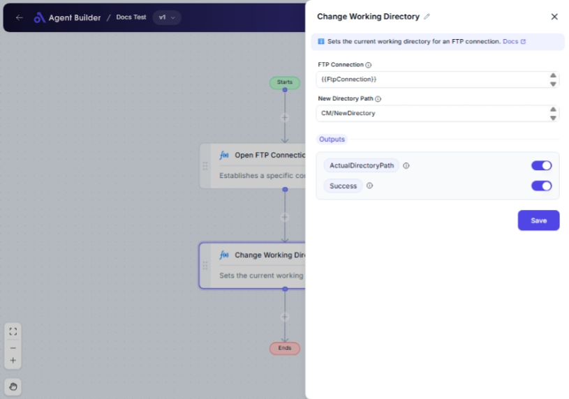

import { Callout, Steps } from "nextra/components";

# Change Working Directory

The **Change Working Directory** node allows you to navigate to a different directory in a connected FTP server. This is crucial when you need to access or organize files within various folders on the server. This node helps automate the navigation process by changing the working directory, allowing subsequent operations to be done in the correct location.

For example:

- Use it to switch to a designated folder before uploading or downloading files.
- Automate changing directories as part of a larger file management workflow.

 

## Configuration Options

| Field Name             | Description                                                             | Input Type | Required? | Default Value |
| ---------------------- | ----------------------------------------------------------------------- | ---------- | --------- | ------------- |
| **FTP Connection**     | The FTP connection object representing the server connection.           | Text       | Yes       | _(empty)_     |
| **New Directory Path** | The path of the new directory you want to set as the working directory. | Text       | Yes       | _(empty)_     |

## Expected Output Format

The node provides two outputs:

- **Actual Directory Path**: The path of the directory after the change. If successful, it shows the actual directory where the operation occurred.
- **Success**: A flag indicating if the directory change was successful (`true` or `false`).

## Step-by-Step Guide

<Steps>
### Step 1

Add **Change Working Directory** node into your flow.

### Step 2

In the **FTP Connection** field, input the details of the FTP server connection you wish to use.

### Step 3

Enter the desired path in the **New Directory Path** field. This is the directory you want to change to on the server.

### Step 4

Once configured, the **Change Working Directory** node will set the working directory to your specified path, yielding an output with the new directory path and success confirmation.

</Steps>

<Callout type="info" title="Tip">
  Ensure the directory path is correctly specified to prevent errors. It's
  helpful to verify directory paths if the operation fails.
</Callout>

## Input/Output Examples

| FTP Connection | New Directory Path  | Actual Directory Path | Success |
| -------------- | ------------------- | --------------------- | ------- |
| myFtpServer    | /files/new-location | /files/new-location   | true    |
| myFtpServer    | /nonexistent/path   |                       | false   |

## Common Mistakes & Troubleshooting

| Problem                                | Solution                                                                                 |
| -------------------------------------- | ---------------------------------------------------------------------------------------- |
| **New Directory Path is incorrect**    | Check for typos in the directory path and verify the directory exists on the FTP server. |
| **Operation failed, Success is false** | Verify the FTP connection details are correct and the server is accessible.              |
| **Connection timeout or errors**       | Ensure the FTP server is online and the credentials provide sufficient permissions.      |

## Real-World Use Cases

- **File Management**: Automatically navigate to the correct directory for specific file operations like collecting updated files for processing.
- **Organized Backups**: Change directories to store backups in designated folder paths.
- **Preliminary Steps**: Set the working directory before batch processing to ensure all subsequent actions are executed in the right location.
