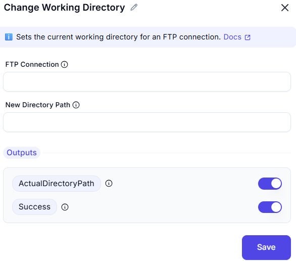

# Change Working Directory

## Description
This screenshot demonstrates an interface for changing the working directory on a remote server (e.g., FTP or SFTP). Users can specify the connection and the new directory path to set as the working directory.

---

## Feilds and Option

### 1. FTP Connection
- Select the active connection (e.g., FTP or SFTP connection).

### 2. New Directory Path
- Enter the new directory path to set as the working directory (e.g., `/documents/reports`).

### 3. Output
    - **ActualDirectoryPath** Returns the actual directory path after change.
    - **Success** Indicates whether the operation was successful
---

## Summary
This tool is useful for navigating and managing directories on a remote server. It allows users to change the working directory, making it easier to perform operations like file uploads, downloads, or directory listings in the desired location.