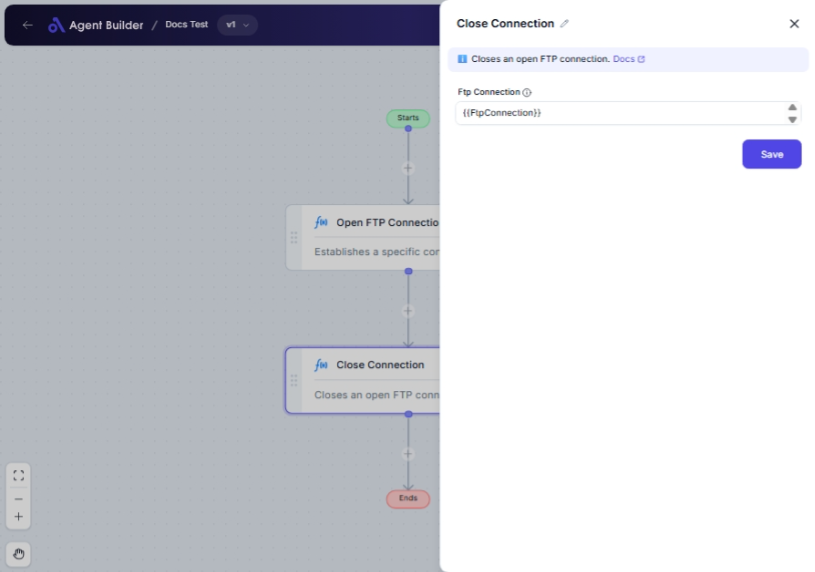

import { Callout, Steps } from "nextra/components";

# Close Connection

The **Close Connection** node is a tool used to terminate an existing FTP connection safely and effectively. By closing the connection, you ensure that resources are not unnecessarily consumed and reduce potential security risks. Use this node when you have finished transferring files or data via FTP and no longer need the connection active.

{/*  */}

## Configuration Options

| Field Name         | Description                           | Input Type | Required? | Default Value |
| ------------------ | ------------------------------------- | ---------- | --------- | ------------- |
| **Ftp Connection** | The FTP connection you want to close. | Text       | Yes       | _(empty)_     |

## Expected Output Format

The node doesn't produce any direct output upon execution. It's used to safely close the FTP connection provided.

## Step-by-Step Guide

<Steps>
### Step 1

Add the **Close Connection** node into your flow.

### Step 2

Fill in the **Ftp Connection** field with the identifier or name of the FTP connection you wish to terminate.

### Step 3

Once configured, the node will execute and close the specified FTP connection.

</Steps>

<Callout type="info" title="Tip">
  Ensure that the FTP connection specified in the **Ftp Connection** field is
  the one you intend to close, especially if managing multiple connections
  simultaneously.
</Callout>

## Common Mistakes & Troubleshooting

| Problem                        | Solution                                                                                                         |
| ------------------------------ | ---------------------------------------------------------------------------------------------------------------- |
| **Empty Ftp Connection field** | Ensure that you have specified the correct FTP connection identifier in the node configuration.                  |
| **Closure not happening**      | Verify if the FTP connection is active and correctly referenced. An inactive or incorrect reference won't close. |

## Real-World Use Cases

- **End of Data Synchronization**: Use the node to terminate connections after completing data uploads or downloads.
- **Conserving Resources**: Close idle connections to free up server resources and prevent consumption charges.
- **Security Assurance**: Shut down connections once operations are complete to mitigate unauthorized access risks.
