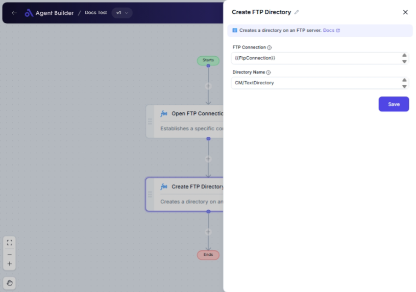

import { Callout, Steps } from "nextra/components";

# Create FTP Directory

The **Create FTP Directory** node is a tool designed to streamline the creation of new directories on an FTP server. It allows you to specify a directory name and establish a connection to your FTP server. This can be invaluable when organizing files, setting up new storage areas, or preparing directories for data upload.

Use this node when you need to efficiently manage directories on your FTP server without manually accessing the server interface.

## Configuration Options

| Field Name         | Description                          | Input Type | Required? | Default Value |
| ------------------ | ------------------------------------ | ---------- | --------- | ------------- |
| **FTP Connection** | The FTP connection object.           | Text       | Yes       | _(empty)_     |
| **Directory Name** | The name of the directory to create. | Text       | Yes       | _(empty)_     |

## Expected Output Format

This node does not generate a data output. Instead, it executes the action of creating a directory on the specified FTP server.

## Step-by-Step Guide

<Steps>
### Step 1

Add the **Create FTP Directory** node to your flow.

### Step 2

In the **FTP Connection** field, enter the connection string or identifier that allows access to your FTP server.

### Step 3

In the **Directory Name** field, input the name of the directory you wish to create.

### Step 4

Confirm your inputs and execute the node to create the directory on the server.

</Steps>

<Callout type="info" title="Note">
  Ensure that your FTP Connection has the necessary permissions to create
  directories on the server.
</Callout>

## Common Mistakes & Troubleshooting

| Problem                                  | Solution                                                                                    |
| ---------------------------------------- | ------------------------------------------------------------------------------------------- |
| **Incorrect FTP connection details**     | Verify your FTP connection credentials and ensure server access is properly configured.     |
| **Directory not created**                | Check for any server-side restrictions or permissions issues preventing directory creation. |
| **Special characters in Directory Name** | Remove any unsupported special characters from the directory name to avoid creation errors. |

## Real-World Use Cases

- **Automated File Organization**: Automatically create directories to sort incoming files, such as by date or file type.
- **Project Setup**: Set up initial directory structures for new projects or teams to facilitate shared file storage.
- **Data Storage Preparation**: Prepare storage locations for batch uploads by creating necessary directories in advance.
