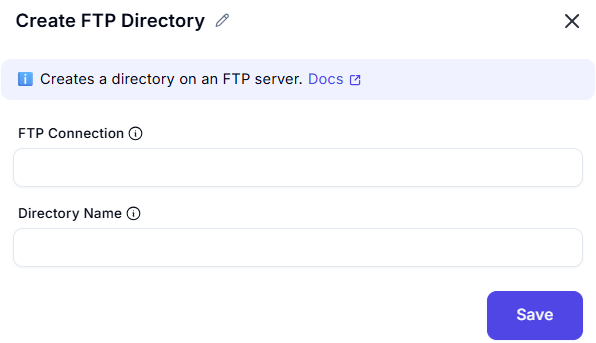

# Create FTP Directory

 **Creates a directory on an FTP server.** [Docs](#)

---
## Configuration Options

### FTP Connection
`[ Enter FTP connection name or variable ]`  
*Provides connection details to the FTP server.*

### Directory Name 
`[ Enter directory name to create on FTP server ]`  
*The name of the folder to be created.*

---

