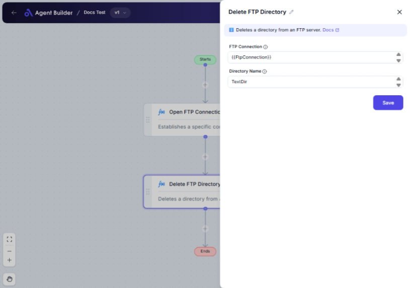

import { Callout, Steps } from "nextra/components";

# Delete FTP Directory

The **Delete FTP Directory** node enables you to remove a directory from an FTP server. This is particularly useful for managing and cleaning up files on remote servers. Use this node when you want to delete unneeded directories to free up space or organize your FTP server.

## Configuration Options

| Field Name         | Description                                               | Input Type | Required? | Default Value |
| ------------------ | --------------------------------------------------------- | ---------- | --------- | ------------- |
| **FTP Connection** | The FTP connection object. Provides server and user info. | Text       | Yes       | _(empty)_     |
| **Directory Name** | The name of the directory to delete.                      | Text       | Yes       | _(empty)_     |

## Expected Output Format

The output of this node is a **confirmation message** that indicates whether the directory has been successfully deleted. If successful, the message will be a simple acknowledgment, such as "Directory deleted."

## Step-by-Step Guide

<Steps>
### Step 1

Add the **Delete FTP Directory** node to your flow.

### Step 2

In the **FTP Connection** field, input the FTP connection details. This should include the necessary information to connect to your FTP server, such as the server address, username, and password.

### Step 3

In the **Directory Name** field, enter the exact name of the directory you wish to delete from the FTP server.

### Step 4

Execute the flow to perform the deletion. Confirm that the directory has been removed from your FTP server's file structure.

</Steps>

<Callout type="warning" title="Caution">
  Deleting a directory is irreversible. Ensure you have backups or confirmations
  before proceeding.
</Callout>

## Input/Output Examples

| FTP Connection      | Directory Name | Output Message    |
| ------------------- | -------------- | ----------------- |
| `ftp://example.com` | `data_old`     | Directory deleted |

## Common Mistakes & Troubleshooting

| Problem                                | Solution                                                                                                                        |
| -------------------------------------- | ------------------------------------------------------------------------------------------------------------------------------- |
| **Invalid FTP connection information** | Ensure that your FTP connection details are correct; verify the server address, username, and password.                         |
| **Directory not found**                | Double-check the directory name for typos or errors. Ensure the directory exists on the FTP server before attempting to delete. |
| **Permission denied**                  | Verify that your FTP account has sufficient permissions to delete directories.                                                  |

## Real-World Use Cases

- **Data Management**: Regularly delete old or temporary directories from an FTP server to keep storage organized.
- **Automated Cleanup**: Set up automated flows that periodically clear specific directories after their contents are no longer necessary.
- **Resource Optimization**: Free up server resources by removing obsolete directories, improving overall server performance and management.
