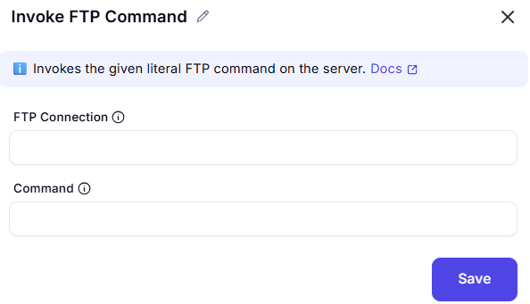

# Invoke FTP Command

## Description
This screenshot demonstrates an interface for invoking a custom FTP command on a remote server. Users can specify the FTP connection and the expected valid reply codes. The output includes the actual reply code and text returned by the FTP server.

---

## Feilds ans Option

### 1. FTP Connection
- Select the active FTP connection to use for the command.

### 2. Command
- Enter the expected valid reply code(s) from the FTP server (e.g., `200` for success).

---
## Summary
This tool is useful for sending custom FTP commands to a remote server and retrieving the server's response. It allows users to validate the success of the command using reply codes and analyze the server's response text.