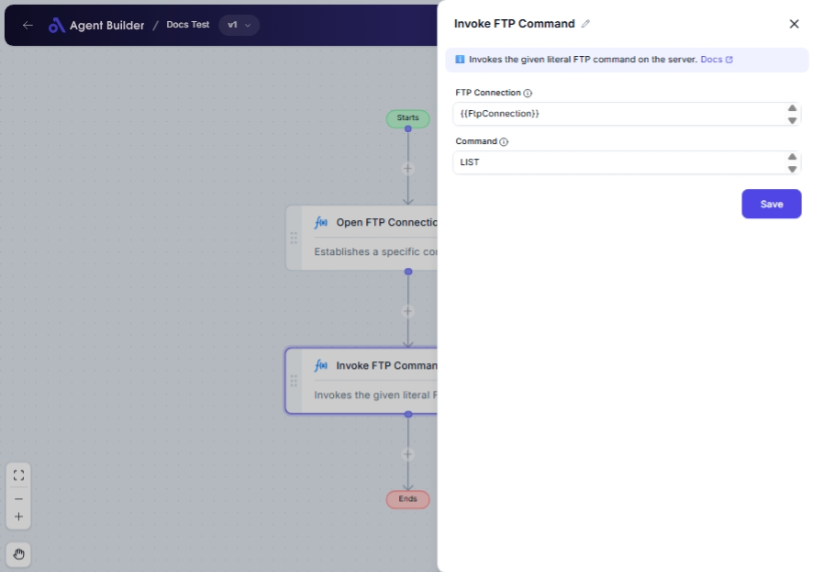

import { Callout, Steps } from "nextra/components";

# Invoke FTP Command

The **Invoke FTP Command** node allows you to interact with an FTP server by sending specific FTP commands. This node is useful when automating file transfers, managing server content, or any other tasks involving an FTP server.

For example:

- Sending a command to upload or download a file.
- Listing files in a directory on the FTP server.
- Deleting files or directories remotely.

{/*  */}

## Configuration Options

| Field Name         | Description                                     | Input Type | Required? | Default Value |
| ------------------ | ----------------------------------------------- | ---------- | --------- | ------------- |
| **FTP Connection** | The connection information for your FTP server. | Text       | Yes       | _(empty)_     |
| **Command**        | The specific FTP command you want to execute.   | Text       | Yes       | _(empty)_     |

## Expected Output Format

The output of this node depends on the command executed. If the command requests data (e.g., LIST), output is generally a **text response** from the server.

## Step-by-Step Guide

<Steps>
### Step 1

Add **Invoke FTP Command** node into your flow.

### Step 2

In the **FTP Connection** field, enter details for connecting to your FTP server. This usually includes server address, username, and password.

### Step 3

In the **Command** field, input the FTP command you wish to execute.

Examples include:

- **LIST**: For listing files in a directory.
- **RETR filename**: To download a file.
- **STOR filename**: To upload a file.

### Step 4

After configuring, the command is sent to the FTP server for execution.

</Steps>

<Callout type="warning" title="Security Note">
  Ensure any sensitive information, like passwords or server addresses, is
  handled securely and in accordance with your organization’s data protection
  policies.
</Callout>

## Input/Output Examples

| FTP Command     | Expected Server Response                                    |
| --------------- | ----------------------------------------------------------- |
| LIST            | Displays a list of files and folders in the specified path. |
| RETR myfile.txt | Returns the contents of "myfile.txt".                       |
| DELE myfile.txt | Confirms that "myfile.txt" has been deleted.                |

## Common Mistakes & Troubleshooting

| Problem                                  | Solution                                                                      |
| ---------------------------------------- | ----------------------------------------------------------------------------- |
| **Invalid FTP Connection details**       | Double-check the server address, username, and password are correct.          |
| **Command not recognized by the server** | Ensure the command syntax is accurate and supported by the FTP server in use. |
| **No response from server**              | Make sure your connection details are correct and the server is reachable.    |

## Real-World Use Cases

- **Automated Backups**: Automate transferring files to an FTP server for backups.
- **Content Management**: Remotely manage website content by sending commands to update files.
- **Data Synchronization**: Automate the transfer of data files between systems for synchronization purposes.
