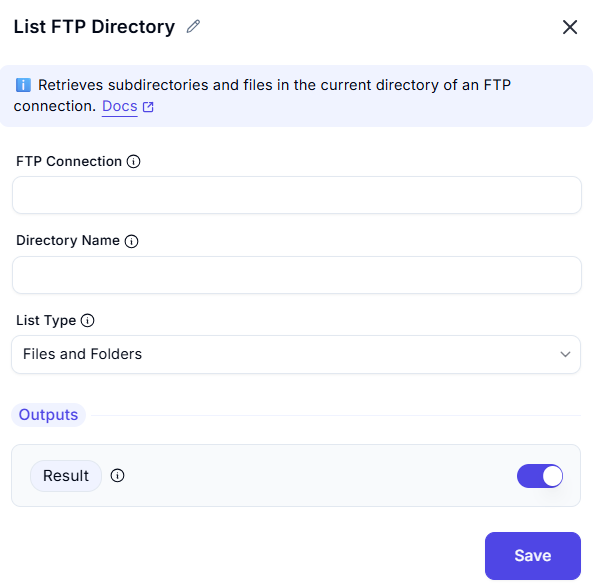

# List FTP Directory

## Description
This screenshot demonstrates an interface for listing the contents of a directory on an FTP server. Users can specify the FTP connection and the directory path to retrieve a list of directories and files.

---

## Feilds ans Option

### 1. FTP Connection
- Select or specify the FTP connection to use.

### 2. Directory Name
- Enter the directory path on the FTP server to list (e.g., `/documents`).

### 3. List Type
- Specifies the type of items to list in the FTP directory.
  - **Files and Folders**
  - **Files**
  - **Folders**
---

## Output
- **Result** Returns the list subdirectories and files
---

## Example: Input and Output

### Scenario
You want to list the contents of the `/documents` directory on an FTP server.

---

### Input
- **Connection**: `FTP_Connection_1` (pre-configured FTP connection).
- **Path**: `/documents`.

---

### Expected Output

- **Directories**:
/documents/reports
/documents/archives

- **Files**:
/documents/report1.pdf
/documents/report2.pdf
/documents/notes.txt

---

## Summary
This tool is useful for retrieving the contents of a directory on an FTP server. It provides a clear list of directories and files, making it easier to navigate and manage files on remote servers.