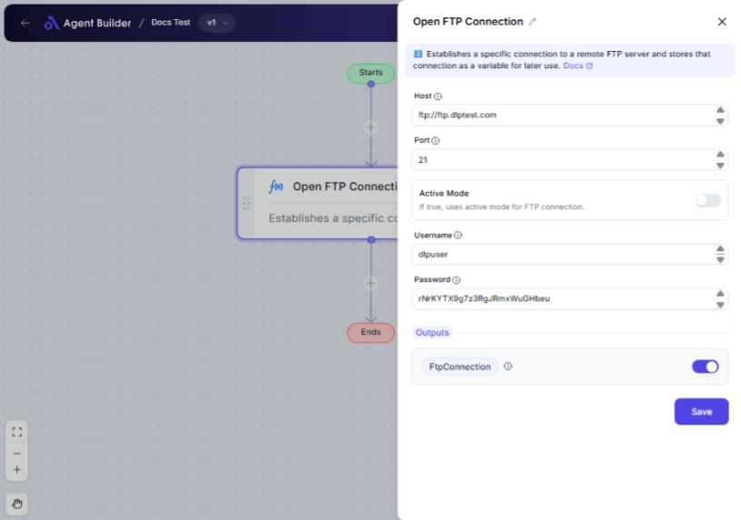

import { Callout, Steps } from "nextra/components";

# Open FTP Connection

The **Open FTP Connection** node lets you establish a connection to an FTP server, allowing you to transfer files to and from the server. It is essential for automating tasks involving file management on remote servers.

You would use this node when you need to upload, download, or manipulate files on an FTP server as part of a larger automated workflow.

{/*  */}

## Configuration Options

| Field Name      | Description                                             | Input Type | Required? | Default Value |
| --------------- | ------------------------------------------------------- | ---------- | --------- | ------------- |
| **Host**        | The FTP server URL (e.g., ftp.example.com).             | Text       | Yes       | _(empty)_     |
| **Port**        | The port number for the FTP connection (default is 21). | Text       | No        | 21            |
| **Active Mode** | If true, uses active mode for FTP connection.           | Switch     | No        | _(empty)_     |
| **Username**    | The username for authentication.                        | Text       | Yes       | _(empty)_     |
| **Password**    | The password for authentication.                        | Text       | Yes       | _(empty)_     |

## Expected Output Format

The output is a **configuration object** known as `FtpConnection`. This object holds the details of the active FTP connection and can be used by other nodes to perform file operations.

## Step-by-Step Guide

<Steps>
### Step 1

Add **Open FTP Connection** node into your flow.

### Step 2

In the **Host** field, enter the FTP server URL where you wish to connect.

### Step 3

(Optionally) Enter the **Port** number used by the server. The default value is `21`.

### Step 4

To use active mode instead of passive mode, toggle **Active Mode** to "Yes".

### Step 5

Fill in the **Username** field with your authentication username.

### Step 6

Enter your authentication **Password**.

### Step 7

The established FTP connection is available as **FtpConnection** for use in subsequent actions such as file upload or download.

</Steps>

<Callout type="info" title="Tip">
  Make sure that the server you are connecting to allows FTP and that you have
  the correct credentials to access it.
</Callout>

## Input/Output Examples

| Host              | Port | Active Mode | Username | Password | Output Value  | Output Type          |
| ----------------- | ---- | ----------- | -------- | -------- | ------------- | -------------------- |
| ftp.example.com   | 21   | No          | user123  | pass123  | FtpConnection | Configuration Object |
| files.example.net | 22   | Yes         | admin    | admin123 | FtpConnection | Configuration Object |

## Common Mistakes & Troubleshooting

| Problem                           | Solution                                                                                                                          |
| --------------------------------- | --------------------------------------------------------------------------------------------------------------------------------- |
| **Connection timeout or refused** | Ensure the FTP server URL and port are correct, and that the server is running. Also, check your network connection.              |
| **Authentication failures**       | Verify that the username and password are entered correctly. Passwords are case-sensitive.                                        |
| **Active Mode not working**       | If there are issues with Active Mode, try switching to the default Passive Mode which generally works better with most firewalls. |

## Real-World Use Cases

- **Automated Backups**: Connect to an FTP server to upload daily backups of important files.
- **Website Management**: Automatically upload updated web files to a server for consistent and timely deployment.
- **Data Synchronization**: Regularly download data files from an FTP server to keep local databases up-to-date.
