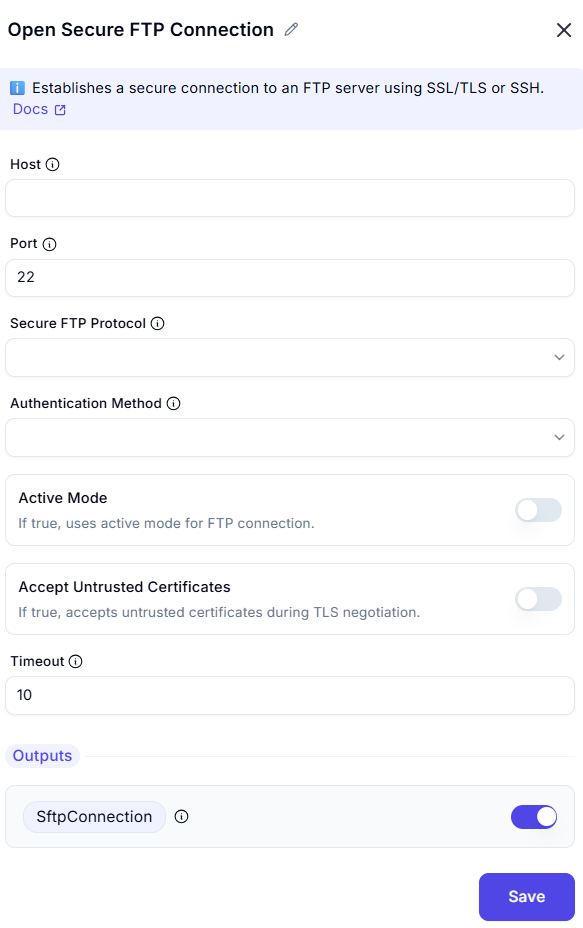

# Open Secure FTP Connection

## Description
This screenshot demonstrates an interface for opening a secure FTP (SFTP) connection to a remote server. Users can specify the host, port, authentication method, and other connection details.

---

## Feilds and Option

### 1. Host
- Enter the host address of the SFTP server (e.g., `sftp.example.com`).

### 2. Port
- Specify the port number for the SFTP connection (default is `22`).

### 3. Secure FTP Protocol
- Specifies the secure FTP protocol to use (SFTP, FTPS explicit, FTPS implicit).

### 4. Authentication Method
- Specifies the authentication method to use (Username and password, Private key, Private key and passphrase).

### 5. Active Mode
- If true, uses active mode for FTP connection.

### 6. Accept Untrusted Certificates
- If true, accepts untrusted certificates during TLS negotiation.

### 7. Timeout
- Set the connection timeout in seconds (e.g., `10`).

## 10. Outputs
- **SftpConnection** is a secure FTP connection object for interacting with the remote server.
---

## Example: Input and Output
You want to connect to an SFTP server with the following details:
- **Host**: `sftp.example.com`
- **Port**: `22`
- **Username**: `user123`
- **Password**: `password123`
- **Timeout**: `10` seconds
### Output
- **SFTP Connection**: A connection object is created, allowing you to interact with the SFTP server (e.g., list files, upload/download files).
---

## Summary
This tool is useful for establishing secure FTP (SFTP) connections to remote servers. It supports authentication via username and password, and allows configuration of connection details like host, port, and timeout.