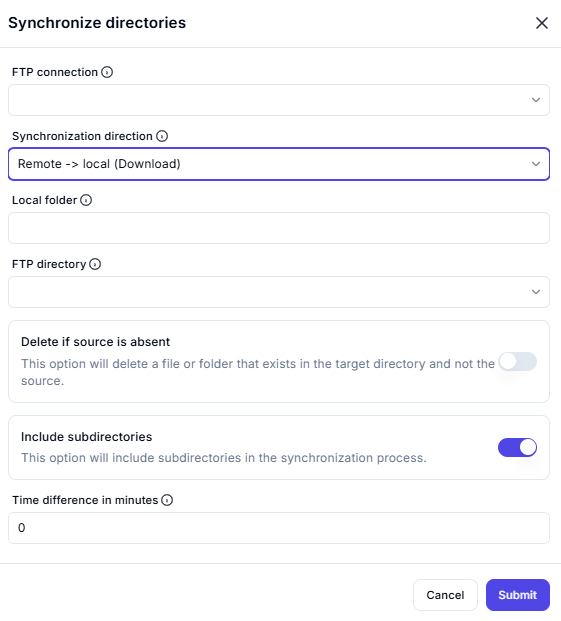

# Synchronize Directories

## Description
This screenshot demonstrates an interface for synchronizing directories between a local system and a remote FTP server. Users can specify the synchronization direction, local folder, FTP directory, and additional options like deleting absent files or including subdirectories.

---

## Feilds and Option

### 1. FTP Connection
- Select the active FTP connection to use for synchronization.

### 2. Synchronization Direction
- Choose the direction of synchronization (e.g., `Remote->local` for downloading files).

### 3. Local Folder
- Specify the local folder where files will be synchronized.

### 4. FTP Directory
- Enter the remote FTP directory to synchronize with the local folder.

### 5. Delete if Source is Absent
-  Enable this option to delete files or folders in the target directory that do not exist in the source directory.

### 6. Include Subdirectories
- Enable this option to include subdirectories in the synchronization process.

### 7. Time Difference in Minutes
- Specify the time difference threshold for synchronization (e.g., `0` for no delay).

---
## Time Difference Ahead
- Specify whether the server’s time zone is ahead of the local system’s time zone.

---

## Output

### FtpFilesDeleted
- A list of FTP files that initially existed in the target directory but were deleted after the synchronization process.

### FtpFilesModified
- A list of FTP files that initially existed in both the source and target directories and were modified during the synchronization process.

### FtpFilesAdded
- A list of FTP files that were added to the target directory during the synchronization process.

---

## Example:

### Scenario

You want to synchronize a remote FTP directory (`/documents`) with a local folder (`C:\LocalDocs`). The server’s time zone is ahead by 2 hours, and you want to track which files were deleted, modified, or added during the process.

---

### ex. Input

- **Time Difference Ahead**: Enabled (server’s time zone is ahead by 2 hours).

---

### ex. Output

- **FtpFilesDeleted**:
/documents/old_report.pdf
/documents/archived_file.txt

- **FtpFilesModified**:

/documents/report1.pdf
/documents/report2.pdf

- **FtpFilesAdded**:

/documents/new_file.docx
/documents/updated_notes.txt

---

## Summary

This tool provides advanced synchronization capabilities, including handling time zone differences and generating detailed reports about file changes. It is ideal for maintaining consistent file structures across systems and tracking changes during synchronization.