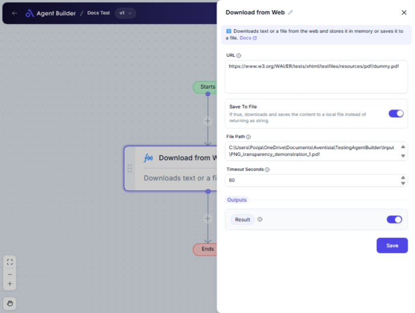

import { Callout, Steps } from "nextra/components";

# Download from Web

The **Download from Web** node enables you to download content from a specified URL, such as web pages or downloadable files. You have the option to either retrieve the content directly as a string or save it to a local file on your computer. Use this node when you need to access online content for data analysis, reporting, or integration into other workflow processes.

 

## Configuration Options

| Field Name          | Description                                                                              | Input Type | Required? | Default Value |
| ------------------- | ---------------------------------------------------------------------------------------- | ---------- | --------- | ------------- |
| **URL**             | The URL of the resource to download (e.g., text, HTML, JSON, PDF).                       | Text       | Yes       | _(empty)_     |
| **Save To File**    | If true, downloads and saves the content to a local file instead of returning as string. | Switch     | No        | _(empty)_     |
| **File Path**       | Full path where the downloaded file should be saved. Required if 'Save To File' is true. | Text       | No        | _(empty)_     |
| **Timeout Seconds** | Maximum time in seconds to wait before failing due to timeout.                           | Text       | No        | 60            |

## Expected Output Format

The output of this node, available as **Result**, will vary based on your configuration:

- If **Save To File** is enabled, the output is the **file path** where the content is saved.
- If **Save To File** is not enabled, the output is the **content in string format**.

## Step-by-Step Guide

<Steps>
### Step 1

Add **Download from Web** node into your workflow.

### Step 2

In the **URL** field, input the address of the resource you wish to download.

### Step 3

If you want to save the content as a file, enable the **Save To File** switch.

### Step 4

If **Save To File** is enabled, specify the **File Path** where the downloaded file should be saved.

### Step 5

Set the **Timeout Seconds** field to define how long to wait for the download; default is 60 seconds.

### Step 6

The successfully downloaded content or file path will be available as **Result** for further use in other nodes.

</Steps>

<Callout type="info" title="Tip">
  The **File Path** field only appears if the **Save To File** switch is
  enabled. Ensure the file path directory is writable.
</Callout>

## Input/Output Examples

| URL                             | Save To File | File Path               | Timeout Seconds | Output Value              | Output Type |
| ------------------------------- | ------------ | ----------------------- | --------------- | ------------------------- | ----------- |
| `http://example.com/data.txt`   | No           | _(n/a)_                 | 60              | "Sample Content from URL" | String      |
| `http://example.com/report.pdf` | Yes          | `/downloads/report.pdf` | 60              | `/downloads/report.pdf`   | File Path   |

## Common Mistakes & Troubleshooting

| Problem                                               | Solution                                                                                      |
| ----------------------------------------------------- | --------------------------------------------------------------------------------------------- |
| **Incorrect URL format**                              | Ensure the URL is correct and includes "http://" or "https://".                               |
| **File Path not specified when Save To File is true** | Specify the full path in the **File Path** field when the **Save To File** switch is enabled. |
| **Download exceeds Timeout**                          | Increase the **Timeout Seconds** value if the download consistently times out.                |
| **File save errors**                                  | Verify the specified path in **File Path** is correct and the directory is writable.          |

## Real-World Use Cases

- **Data Gathering**: Automatically collect data from online sources, such as CSV or JSON files, for analysis.
- **Report Downloading**: Download and store reports or PDFs from web portals for compliance or archival purposes.
- **Content Integration**: Retrieve and integrate web page content into automated document generation processes.
