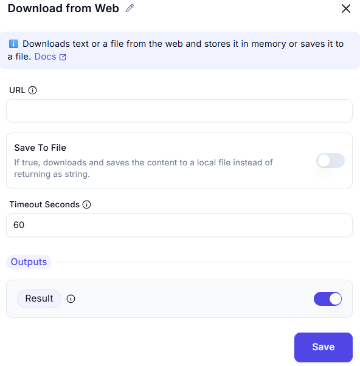

# Download from Web

This action is used to **download text or a file** from a specified web URL. It can either return the content as a string or save it as a file locally.



---

### Configuration Options

| **Field**        | **Description**                                                                 |
|------------------|---------------------------------------------------------------------------------|
| `URL`            | The web address (URL) to download content from.                                 |
| `Save To File`   | When enabled, the downloaded content will be saved to a file rather than returned as a string. |
| `Timeout Seconds`| Time to wait (in seconds) before cancelling the download if it hasn't completed. Default is `60`. |

---

### Output

| **Name**  | **Type** | **Description**                                  |
|-----------|----------|--------------------------------------------------|
| `Result`  | String   | If `Save To File` is disabled, this holds the downloaded content as text. If enabled, it holds the file path. |

---

### Example Usage
```plaintext
URL: https://example.com/data.json
Save To File: false
Timeout Seconds: 30
```
This will return the contents of the `data.json` file as a string to `Result`.
---
### Tips
- If you're downloading binary content (e.g., images, PDFs), ensure `Save To File` is **enabled** to prevent corrupt data in the `Result`.
- Use this action in web scraping or API integrations to fetch data dynamically.
