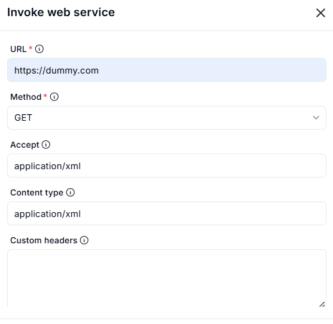

# Invoke SOAP Web Service

## Description
This action is used to invoke a specified **method from a SOAP web service** and return the response.




---

### Fields and Option

| **Field**                     | **Description**                                                                 |
|-------------------------------|---------------------------------------------------------------------------------|
| `Endpoint URL`                | URL of the SOAP web service (typically ending in `.asmx` or `.wsdl`).          |
| `Method Name`                 | Name of the SOAP method to be called.                                          |
| `Parameters`                  | Parameters to pass to the SOAP method (in name-value pair format or JSON).     |
| `Timeout Seconds`             | Time in seconds to wait for the response before cancelling the request. Default is `60`. |
| `Use Custom Action Namespace` | Enable this if the SOAP service requires a specific XML namespace for the method call. |

---

### Output

| **Name** | **Type** | **Description**                     |
|----------|----------|-------------------------------------|
| `Result` | String   | The response returned by the SOAP service. |

---

### Example Usage

```plaintext
Endpoint URL: https://example.com/WeatherService.asmx
Method Name: GetWeatherByZip
Parameters: {"ZipCode": "90210"}
Timeout Seconds: 30
Use Custom Action Namespace: false
```

---

### Tips

- Ensure the SOAP service and WSDL are publicly accessible or authenticated appropriately.
- Use the correct **parameter names** as required by the WSDL schema.
- If you're getting errors, inspect the **SOAP envelope** and consider using `Custom Namespace` for compatibility.
