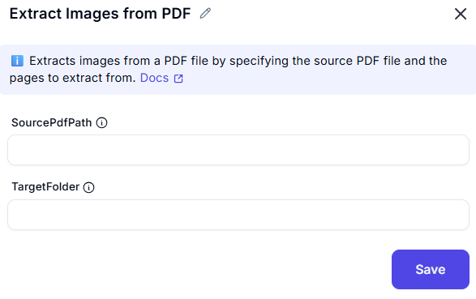

# Extract Images from PDF  

## Description
This interface allows users to extract images from a PDF document and save them to a specified location.

---

### 1. SourcePdfPath
- The path to the source PDF file.

### 2. TargetFolder
- The target folder to save the extracted images