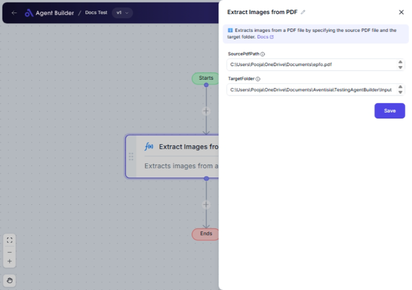

import { Callout, Steps } from "nextra/components";

# Extract Images from PDF

The **Extract Images from PDF** node is designed to help you automatically extract all images from a PDF file and save them as separate image files in a specified folder. This can be especially useful in situations where you need to analyze, archive, or reuse images from PDF documents without manually going through each file.

For example:

- Quickly extracting images from PDF reports to include in presentations or emails.
- Archiving images from PDF catalogs or brochures for inventory purposes.
- Reusing images from PDF design documents without having to recreate them.

{/*  */}

## Configuration Options

| Field Name        | Description                                                      | Input Type | Required? | Default Value |
| ----------------- | ---------------------------------------------------------------- | ---------- | --------- | ------------- |
| **SourcePdfPath** | The path to the source PDF file you want to extract images from. | Text       | Yes       | _(empty)_     |
| **TargetFolder**  | The destination folder where the extracted images will be saved. | Text       | Yes       | _(empty)_     |

## Expected Output Format

The output of this node is a set of **image files** saved in the specified directory. Each image extracted from the PDF will be saved as an individual file, maintaining its original format.

## Step-by-Step Guide

<Steps>
### Step 1

Add **Extract Images from PDF** node into your flow.

### Step 2

In the **SourcePdfPath** field, enter the path to the PDF file from which you want to extract images.

### Step 3

In the **TargetFolder** field, specify the folder where you want to save the extracted images.

### Step 4

After configuring, the images will be extracted and saved in the specified target folder.

</Steps>

<Callout type="info" title="Tip">
  Ensure that the specified target folder exists and has the necessary write
  permissions. Otherwise, the extraction process might fail.
</Callout>

## Input/Output Examples

| Source PDF Path                | Target Folder           | Output Files                                                               |
| ------------------------------ | ----------------------- | -------------------------------------------------------------------------- |
| `/documents/annual_report.pdf` | `/images/annual_report` | All images from the PDF saved as individual files in /images/annual_report |

## Common Mistakes & Troubleshooting

| Problem                     | Solution                                                                                  |
| --------------------------- | ----------------------------------------------------------------------------------------- |
| **Invalid Source PDF Path** | Ensure the PDF file path is correct and the file exists at the specified location.        |
| **Invalid Target Folder**   | Verify the folder path is correct and that you have necessary permissions to write to it. |
| **PDF File without Images** | If no images are extracted, ensure the PDF contains images to be extracted.               |

## Real-World Use Cases

- **Marketing Material Preparation**: Extract images from a PDF catalog for use in digital marketing and advertising.
- **Document Review and Archiving**: Quickly copy images from PDF reports into a digital archive for easy access and review.
- **Graphic Design Projects**: Reuse images from PDF design drafts for quicker modification or enhancements.
