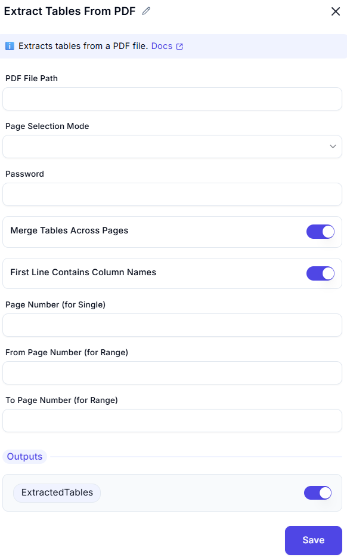

# Extract Tables From PDF

This activity is used to **extract tables from a PDF file** in a structured format, enabling further processing in automation workflows.


---

### Configuration Options

| **Field**                         | **Description** |
|-----------------------------------|------------------|
| `PDF File Path`                   | Full path of the PDF file from which to extract tables. |
| `Page Selection Mode`             | Choose how to specify the page(s): Single page; Page range; All pages |
| `Password`                        | Enter the password if the PDF is protected. |
| `Merge Tables Across Pages`       | If enabled, merges tables that span multiple pages. |
| `First Line Contains Column Names`| If enabled, treats the first row as the header for the extracted table. |
| `Page Number (for Single)`        | Specific page number to extract from (used if `Single page` is selected). |
| `From Page Number`                | Starting page number for extraction. |
| `To Page Number`                  | Ending page number for extraction. |

---

### Output

| **Name**          | **Type**     | **Description**                              |
|-------------------|--------------|----------------------------------------------|
| `ExtractedTables` | DataTable[]  | Array of extracted data tables from the PDF. |

---

### Example Usage

```plaintext
PDF File Path: C:\Documents\Invoice2024.pdf
Page Selection Mode: Page range
From Page Number: 2
To Page Number: 4
Merge Tables Across Pages: Enabled
First Line Contains Column Names: Enabled
```
This will extract all tables between pages 2 and 4 and treat the first row of each table as column headers.
---
### Tips
- If the table structure in the PDF is not well-defined, results may be inconsistent.
- Use `For Each` loop to iterate through the extracted tables for further processing.
