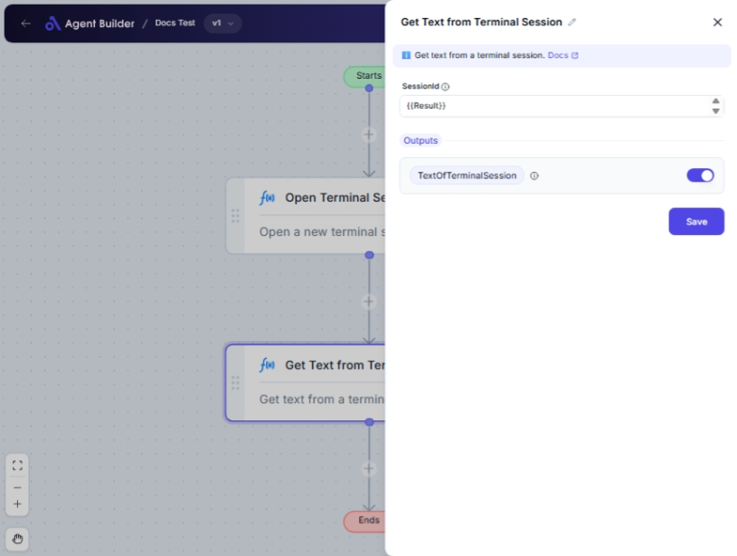

import { Callout, Steps } from "nextra/components";

# Get Text from Terminal Session

The **Get Text from Terminal Session** node is designed to extract and retrieve text from a specified terminal session. This node is useful for situations where you need to pull information or results from terminal-based activities within an automated workflow.

Common scenarios include:

- Gathering output after a script execution.
- Extracting log data or status messages for further processing.
- Integrating terminal interactions smoothly into workflows.

## Configuration Options

| Field Name    | Description                                                                    | Input Type | Required? | Default Value |
| ------------- | ------------------------------------------------------------------------------ | ---------- | --------- | ------------- |
| **SessionId** | The unique identifier for the terminal session you want to retrieve text from. | Text       | Yes       | _(empty)_     |
| **TextofTerminalSession**    | A container that holds the resulting text extracted from the terminal session. | Output     | No        | Result        |

## Expected Output Format

The output from the **Get Text from Terminal Session** node is:

- A **string of text** that was retrieved from the terminal session.

This output is ready to be used in consecutive nodes within your automation workflow.

## Step-by-Step Guide

<Steps>
### Step 1

Add the **Get Text from Terminal Session** node into your flow.

### Step 2

In the **SessionId** field, enter the session ID of the specific terminal session from which you wish to retrieve text.

### Step 3

Ensure that your workflow provides or correctly processes the session ID to match an active terminal session.

### Step 4

Proceed with the workflow. The node will output the retrieved text as **Result**, which can be utilized or stored by subsequent nodes.

</Steps>

<Callout type="info" title="Note">
  It's crucial to use a correct and active session ID in the **SessionId**
  field. Incorrect session IDs will not return any text.
</Callout>

## Input/Output Examples

| Session ID | Output Value                             | Output Type |
| ---------- | ---------------------------------------- | ----------- |
| 12345      | "Login successful. User data fetched."   | String      |
| 67890      | "Process completed. No errors detected." | String      |

## Common Mistakes & Troubleshooting

| Problem                                 | Solution                                                                                     |
| --------------------------------------- | -------------------------------------------------------------------------------------------- |
| **Invalid Session ID error**            | Verify that the session ID entered corresponds to an active session or is correctly entered. |
| **Empty output despite active session** | Double-check the terminal session's output within the time frame of the node's activation.   |
| **Unexpected text output**              | Ensure the terminal session is producing the expected textual result during the retrieval.   |

## Real-World Use Cases

- **Automation Reporting**: Extract script results from a server to document or analyze outcomes automatically.
- **Monitoring Systems**: Collect log data from a terminal interface to track system status or error messages.
- **Real-Time Status Updates**: Retrieve ongoing session outputs to provide live feedback or status notifications.
