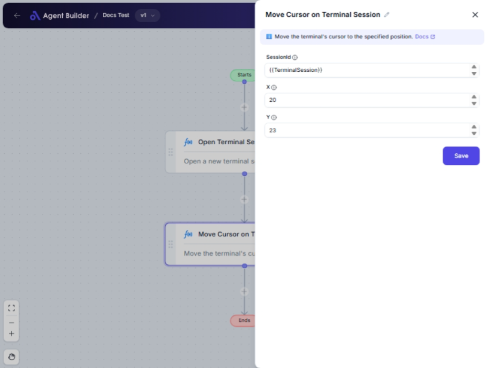

import { Callout, Steps } from "nextra/components";

# Move Cursor on Terminal Session

The **Move Cursor on Terminal Session** node is designed to reposition the cursor within an active terminal session. This can be used for automation tasks that require precise cursor movements to a specific location in the terminal interface, aiding in task execution or data entry operations.

For example:

- Positioning the cursor to start typing at a specific location in a text-based interface.
- Aligning input or output pointers to facilitate sequential process automation.

{/*  */}

## Configuration Options

| Field Name    | Description                                      | Input Type | Required? | Default Value |
| ------------- | ------------------------------------------------ | ---------- | --------- | ------------- |
| **SessionId** | The unique identifier of the terminal session.   | Text       | Yes       | _(empty)_     |
| **X**         | The horizontal (column) position for the cursor. | Text       | Yes       | _(empty)_     |
| **Y**         | The vertical (row) position for the cursor.      | Text       | Yes       | _(empty)_     |

## Expected Output Format

The output of this node confirms the cursor has moved to the intended position in the terminal session. It does not produce a visible data output or return data to other nodes.

## Step-by-Step Guide

<Steps>
### Step 1

Add **Move Cursor on Terminal Session** node into your flow.

### Step 2

Enter the **SessionId** in the corresponding field. This links the action to the specific terminal session you wish to control.

### Step 3

Specify the **X** coordinate in the text field to indicate the column where you want the cursor to move.

### Step 4

Enter the **Y** coordinate in the text field to define the row for cursor positioning.

### Step 5

The cursor is now set to move to the X and Y coordinates you specified within the given terminal session.

</Steps>

<Callout type="info" title="Tip">
  Ensure that both X and Y coordinates are within the valid range for your
  terminal display to prevent errors.
</Callout>

## Input/Output Examples

| SessionId | X   | Y   | Action                           |
| --------- | --- | --- | -------------------------------- |
| ABC123    | 10  | 15  | Move cursor to column 10, row 15 |

## Common Mistakes & Troubleshooting

| Problem                               | Solution                                                                     |
| ------------------------------------- | ---------------------------------------------------------------------------- |
| **Invalid SessionId**                 | Verify that you have entered a correct and active SessionId.                 |
| **Cursor Not Moving**                 | Check that X and Y coordinates are within the terminal's actual size limits. |
| **Incorrect Coordinates Positioning** | Double-check if X and Y are swapped. X refers to columns and Y to rows.      |

## Real-World Use Cases

- **Automated Script Entry**: Facilitates scripts that need cursor movement for data entry or command execution positions.
- **Dynamic Terminal Interaction**: Enables interaction in complex terminal applications by moving to desired locations before executing commands.
