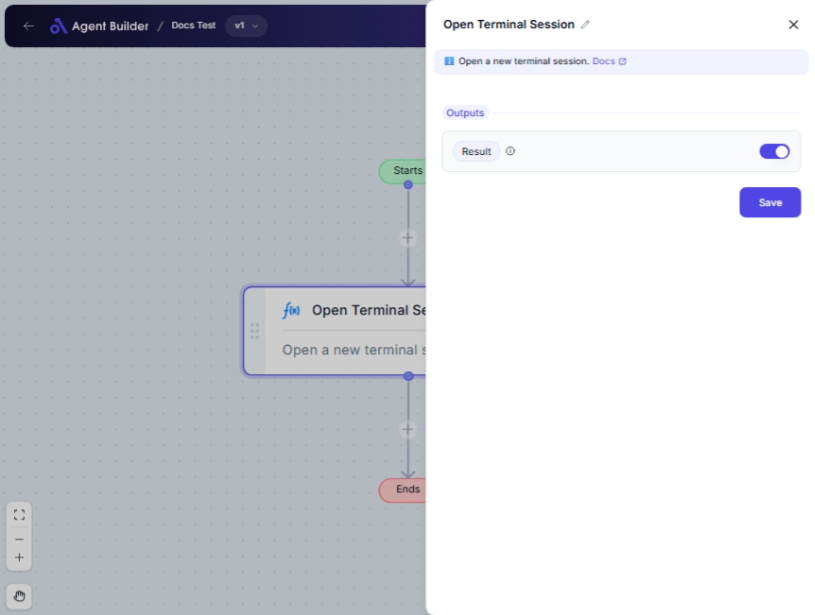

import { Callout, Steps } from "nextra/components";

# Open Terminal Session

The **Open Terminal Session** node is designed to initiate a terminal session on your machine. It returns a session ID once the terminal is successfully launched, allowing you to carry out further command executions within this session. This node is especially useful when you need to automate tasks that require terminal operations, such as running scripts or managing configuration setups directly from the command line.

{/*  */}

## Configuration Options

| Field Name | Description                                                                                                           | Input Type | Required? | Default Value |
| ---------- | --------------------------------------------------------------------------------------------------------------------- | ---------- | --------- | ------------- |
| **Result** | Outputs the session ID of the opened terminal session. This ID can be used to reference the session in further tasks. | Output     | No        | Result        |

## Expected Output Format

The output of this node is a **string** representing the session ID. This ID acts as a reference to the terminal session that has been opened, enabling further interaction with it. For example, `Session123456`.

## Step-by-Step Guide

<Steps>
### Step 1

Add the **Open Terminal Session** node into your flow.

### Step 2

Ensure any prerequisite software or permissions for opening a terminal session on your machine are active.

### Step 3

Upon successful execution, the node provides a session ID as its output. This ID appears as the **Result**.

### Step 4

Use the session ID for running subsequent commands or interacting with the terminal session through other nodes in your flow.

</Steps>

<Callout type="info" title="Note">
  The **Result** field is automatically set and you do not need to input any
  values here. It simply outputs the session ID for you to use in future tasks.
</Callout>

## Input/Output Examples

| Operation             | Output Result | Expected Type       |
| --------------------- | ------------- | ------------------- |
| Open Terminal Session | Session123456 | String (Session ID) |

## Common Mistakes & Troubleshooting

| Problem                                      | Solution                                                                                                       |
| -------------------------------------------- | -------------------------------------------------------------------------------------------------------------- |
| **Terminal not launching**                   | Ensure your system's terminal and automation platform have the necessary permissions or access rights enabled. |
| **Session ID not appearing in Result field** | Verify that the node is correctly added and executed in the flow. Check system logs for any errors.            |

## Real-World Use Cases

- **Automate Script Execution**: Open a terminal session to run scripts automatically, saving time on manual inputs and executions.
- **Configuration Management**: Initiate a terminal session for managing configurations or file modifications through automated scripts.
- **System Monitoring**: Execute commands in a terminal session to monitor system logs or performance metrics as part of your workflow automation.
