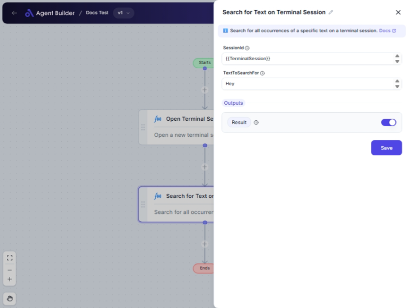

import { Callout, Steps } from "nextra/components";

# Search for Text on Terminal Session

The **Search for Text on Terminal Session** node allows you to find specific text within a terminal session by searching through the session data provided via a unique session ID. This is particularly useful when you want to scan terminal outputs for specific keywords or strings to monitor operations, errors, or data logs.

Typical use cases include:

- Checking logs for error messages.
- Searching for specific command outputs.
- Scanning through session data for specific configuration or status updates.

## Configuration Options

| Field Name          | Description                                            | Input Type | Required? | Default Value |
| ------------------- | ------------------------------------------------------ | ---------- | --------- | ------------- |
| **SessionId**       | The session ID of the terminal session.                | Text       | Yes       | _(empty)_     |
| **TextToSearchFor** | The text you wish to search for in the session.        | Text       | Yes       | _(empty)_     |
| **Result**          | Displays the list of occurrences of the searched text. | Output     | No        | Result        |

## Expected Output Format

The node outputs a **list of occurrences** where the searched text was found within the terminal session. Each occurrence provides contextual information (if available) about where the text is located in the session data.

## Step-by-Step Guide

<Steps>
### Step 1

Add the **Search for Text on Terminal Session** node into your flow.

### Step 2

In the **SessionId** field, enter the session ID that corresponds to the terminal session you want to search.

### Step 3

In the **TextToSearchFor** field, enter the text string you are looking to find within the terminal session.

### Step 4

The results will be available as **Result** and will show all occurrences of the specified text within the session.

</Steps>

<Callout type="info" title="Tip">
  Ensure the session ID is correct and active to obtain relevant search results.
  Invalid session IDs will result in no matches being found.
</Callout>

## Input/Output Examples

| SessionId | TextToSearchFor | Output Result                                    | Output Type    |
| --------- | --------------- | ------------------------------------------------ | -------------- |
| 12345     | "Error"         | ["Error at line 23", "Error at init"]            | List of String |
| 67890     | "Success"       | ["Operation Success", "Success check completed"] | List of String |

## Common Mistakes & Troubleshooting

| Problem                             | Solution                                                                                   |
| ----------------------------------- | ------------------------------------------------------------------------------------------ |
| **Results not showing as expected** | Double-check the session ID and the text entered; make sure they are correct and relevant. |
| **Empty search result**             | Verify that the text actually exists in the session data you are searching.                |
| **Incorrect session ID**            | Reconfirm that the session ID is accurately input and corresponds to an existing session.  |

## Real-World Use Cases

- **Log Monitoring**: Continuously search terminal sessions for specific error or success messages in application logs.
- **QA Testing**: Verify output messages in terminal sessions by searching for expected strings as test case validation.
- **System Administration**: Track specific commands' impact by searching session logs for related outputs.
- **Security Audits**: Check for unauthorized access or command executions by searching terminal data for suspicious keywords.
