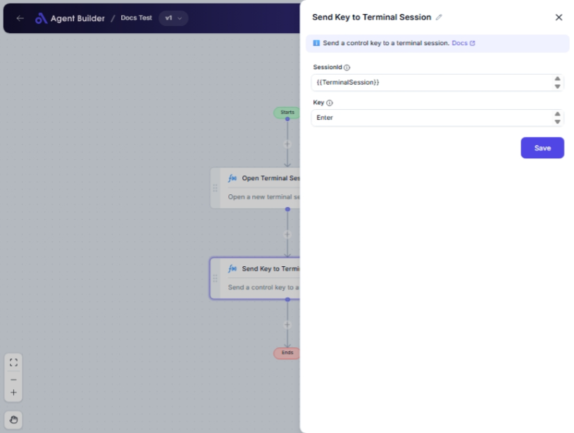

import { Callout, Steps } from "nextra/components";

# Send Key to Terminal Session

The **Send Key to Terminal Session** node enables you to interact with a terminal session by sending specified keystrokes. This is particularly useful when automating repetitive tasks that require keystrokes, such as navigating through terminal applications or triggering commands.

## Configuration Options

| Field Name    | Description                                                        | Input Type | Required? | Default Value |
| ------------- | ------------------------------------------------------------------ | ---------- | --------- | ------------- |
| **SessionId** | The unique ID of the terminal session you wish to interact with.   | Text       | Yes       | _(empty)_     |
| **Key**       | The specific key you want to send to the terminal (e.g., 'Enter'). | Text       | Yes       | _(empty)_     |

## Expected Output Format

The action of sending a key to a terminal session does not produce a direct output in the data flow. The effect will be observed by the response or action performed within the targeted terminal session.

## Step-by-Step Guide

<Steps>
### Step 1

Add **Send Key to Terminal Session** node into your flow.

### Step 2

In the **SessionId** field, enter the ID of the active terminal session that you want to interact with.

### Step 3

In the **Key** field, specify the key you wish to send (e.g., 'Enter', 'Tab').

### Step 4

Execute the process to send the key to the specified terminal session and observe the desired action in the session interface.

</Steps>

<Callout type="warning" title="Important">
  Ensure the terminal session specified in **SessionId** is active and correctly
  identified to prevent errors.
</Callout>

## Input/Output Examples

- Sending the 'Enter' key to execute a command: If you have navigated to a folder in a terminal and need to list files with `ls`, sending 'Enter' would execute the command.
- Sending 'Tab' to auto-complete a command or path: If typing a partial command or path, using 'Tab' can auto-complete your input effectively.

## Common Mistakes & Troubleshooting

| Problem                    | Solution                                                                                                        |
| -------------------------- | --------------------------------------------------------------------------------------------------------------- |
| **SessionId not found**    | Verify that the correct and active `SessionId` is entered. Check your terminal session list for the correct ID. |
| **Unintended key actions** | Double-check the key specified in **Key** to ensure it matches the expected command or navigation input.        |

## Real-World Use Cases

- **Automating Terminal Tasks**: Use in script automation to perform tasks like navigation, file manipulation, or running commands.
- **Development Automation**: Useful in CI/CD pipelines or developer environments where certain operations need repeat easy execution.
- **System Administration**: Administrators can automate server configurations or maintenance tasks via terminal interactions.
