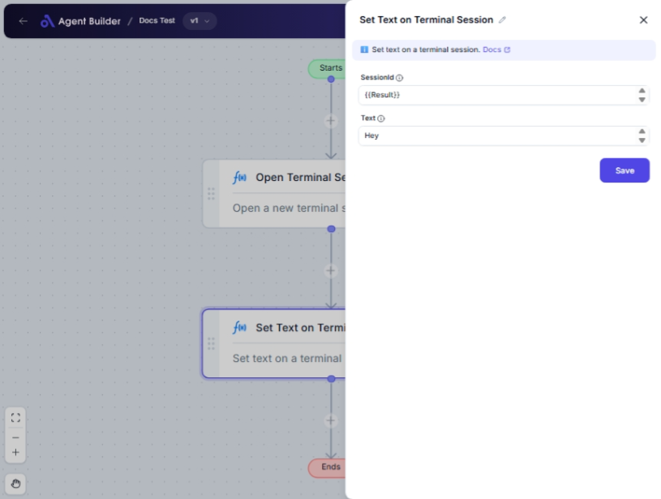

import { Callout, Steps } from "nextra/components";

# Set Text on Terminal Session

The **Set Text on Terminal Session** node enables you to send specific text input to an active terminal session. This is useful for automating command line activities, scripting, or inputting data directly into a terminal without manual typing, ensuring accuracy and saving time.

{/*  */}

## Configuration Options

| Field Name    | Description                              | Input Type | Required? | Default Value |
| ------------- | ---------------------------------------- | ---------- | --------- | ------------- |
| **SessionId** | The session ID of the terminal session.  | Text       | Yes       | _(empty)_     |
| **Text**      | The text to set on the terminal session. | Text       | Yes       | _(empty)_     |

## Expected Output Format

This node does not produce a traditional output but performs an action by setting the provided text into the given terminal session.

## Step-by-Step Guide

<Steps>
### Step 1

Add the **Set Text on Terminal Session** node into your flow.

### Step 2

In the **SessionId** field, enter the ID of your active terminal session.

### Step 3

In the **Text** field, type the text or command you want to input into the terminal session.

### Step 4

Ensure that your terminal session is active and connected. The text will be set when the node executes.

</Steps>

<Callout type="info" title="Note">
  Ensure your terminal session is established and the SessionId is correctly
  copied to prevent issues.
</Callout>

## Input/Output Examples

| SessionId | Text               | Action Outcome                   |
| --------- | ------------------ | -------------------------------- |
| `123456`  | `echo Hello World` | Echoes "Hello World" in terminal |

## Common Mistakes & Troubleshooting

| Problem                            | Solution                                                                    |
| ---------------------------------- | --------------------------------------------------------------------------- |
| **Session does not respond**       | Verify that the entered **SessionId** is correct and the session is active. |
| **Text not appearing in terminal** | Double-check the **Text** input for any missing or incorrect commands.      |
| **Node execution with no effect**  | Confirm that terminal permissions and connection are properly set up.       |

## Real-World Use Cases

- **Automating Scripts**: Send commands to execute scripts automatically within a terminal session.
- **Deploying Applications**: Enter deployment commands without manual typing to streamline processes.
- **System Monitoring**: Send inquiry commands to a session for real-time system status checks.
