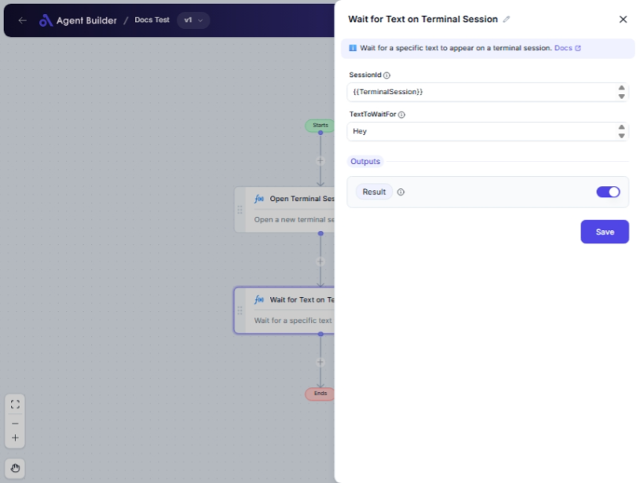

import { Callout, Steps } from "nextra/components";

# Wait for Text on Terminal Session

The **Wait for Text on Terminal Session** node is designed to monitor an active terminal session and wait until a specific text appears. This is particularly useful when automating sequences of commands in a terminal environment where you need to pause execution until certain output is visible before proceeding with the next steps.

For example:

- Monitoring for a successful login prompt in a remote session.
- Waiting for a confirmation message before proceeding with the next command.
- Synchronizing automated processes based on terminal output.

{/*  */}

## Configuration Options

| Field Name        | Description                                                                                                      | Input Type | Required? | Default Value |
| ----------------- | ---------------------------------------------------------------------------------------------------------------- | ---------- | --------- | ------------- |
| **SessionId**     | The session ID of the terminal session you're working with. Use this to designate the active session to monitor. | Text       | Yes       | _(empty)_     |
| **TextToWaitFor** | The specific text string you are waiting to appear in the terminal session.                                      | Text       | Yes       | _(empty)_     |

## Expected Output Format

The output from this node is a **boolean value** (either `true` or `false`).

- **true**: The specified text has been found in the terminal session.
- **false**: The specified text was not found (or the process timed out).

## Step-by-Step Guide

<Steps>
### Step 1

Add the **Wait for Text on Terminal Session** node into your flow.

### Step 2

In the **SessionId** field, enter the unique identifier of the terminal session you aim to monitor.

### Step 3

In the **TextToWaitFor** field, input the specific text string you expect to see in the terminal session output.

### Step 4

Once configured, the node will actively check for the text in the chosen terminal session.

### Step 5

The output, **Result**, will inform you whether the text was detected (`true`) or not (`false`) and is available for subsequent actions in your flow.

</Steps>

<Callout type="info" title="Tip">
  Ensure the <b>SessionId</b> corresponds to an active session. If the session
  has ended, you will not receive the expected result.
</Callout>

## Input/Output Examples

| Input Example           | Expected Terminal Output | Expected Result | Result Type |
| ----------------------- | ------------------------ | --------------- | ----------- |
| SessionId: `123`        | "Connected successfully" | true            | Boolean     |
| TextToWaitFor: `login:` |                          |                 |             |

## Common Mistakes & Troubleshooting

| Problem                                    | Solution                                                                                                        |
| ------------------------------------------ | --------------------------------------------------------------------------------------------------------------- |
| **SessionId or TextToWaitFor left blank**  | Both fields are required. Ensure you fill in both to successfully monitor the terminal session.                 |
| **Did not detect text, even when visible** | Verify that SessionId is correct, and check for exact matches in text, including whitespace and capitalization. |
| **Result returns false unexpectedly**      | Double-check the session status. If it's closed or inactive, text detection will fail.                          |

## Real-World Use Cases

- **Remote Server Management**: Wait for a login prompt before sending automated login credentials to a remote server.
- **Database Operations**: Monitor for "Operation completed" before starting a data backup script.
- **Software Deployment**: Await "Deployment successful" message before proceeding to post-deployment testing steps.
