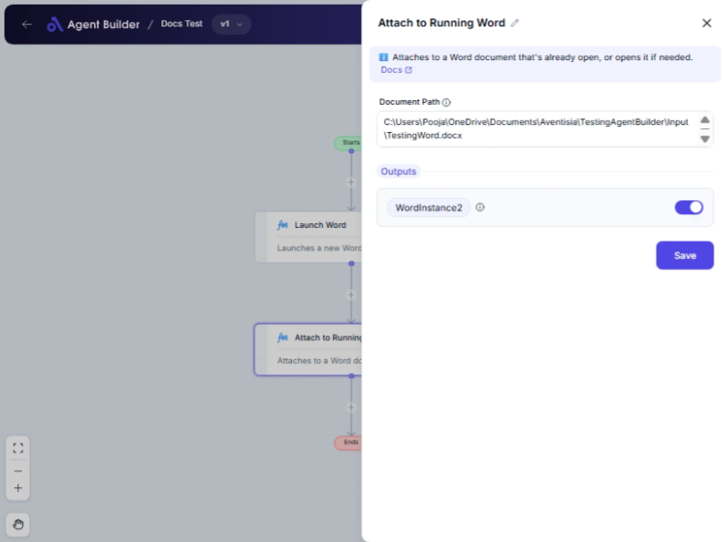

import { Callout, Steps } from "nextra/components";

# Attach to Running Word

The **Attach to Running Word** node connects to an active Microsoft Word document, allowing you to perform further actions on it. This is particularly useful when you want to automate tasks or extend functionality within an already open Word document.

Use cases include editing, analyzing, or extracting text from an opened document without needing to open a new instance of Word.

{/* */}

## Configuration Options

| Field Name        | Description                                 | Input Type | Required? | Default Value |
| ----------------- | ------------------------------------------- | ---------- | --------- | ------------- |
| **Document Name** | The name of the Word document to attach to. | Text       | Yes       | _(empty)_     |

## Expected Output Format

This node outputs a **Word Instance**, which serves as a reference to the specific Word document you are interacting with. It enables further automated actions within this document setup.

## Step-by-Step Guide

<Steps>
### Step 1

Add the **Attach to Running Word** node into your flow.

### Step 2

In the **Document Name** field, enter the exact name of the Word document you wish to attach to. Ensure the document is currently open in Word.

### Step 3

The node will output a reference as **WordInstance**, which can be used for subsequent tasks on this document.

</Steps>

<Callout type="info" title="Tip">
  The document must be open in Word for the node to attach to it successfully.
</Callout>

## Input/Output Examples

| Input         | Output       | Output Type            |
| ------------- | ------------ | ---------------------- |
| "report.docx" | WordInstance | Word Document Instance |

## Common Mistakes & Troubleshooting

| Problem                           | Solution                                                                                                 |
| --------------------------------- | -------------------------------------------------------------------------------------------------------- |
| **Document not found**            | Ensure the document name matches exactly with the open Word document. Check for typos or cases.          |
| **WordInstance not recognizable** | Make sure that the Word instance is active and ready to interact with before attempting further actions. |

## Real-World Use Cases

- **Collaboration**: Attach to a shared Word document to monitor changes or updates in real-time.
- **Automated Edits**: Automate the process of editing a document already opened, such as adding data or comments.
- **Data Extraction**: Extract specific parts of an open document for analysis, like extracting all instances of a certain keyword.
