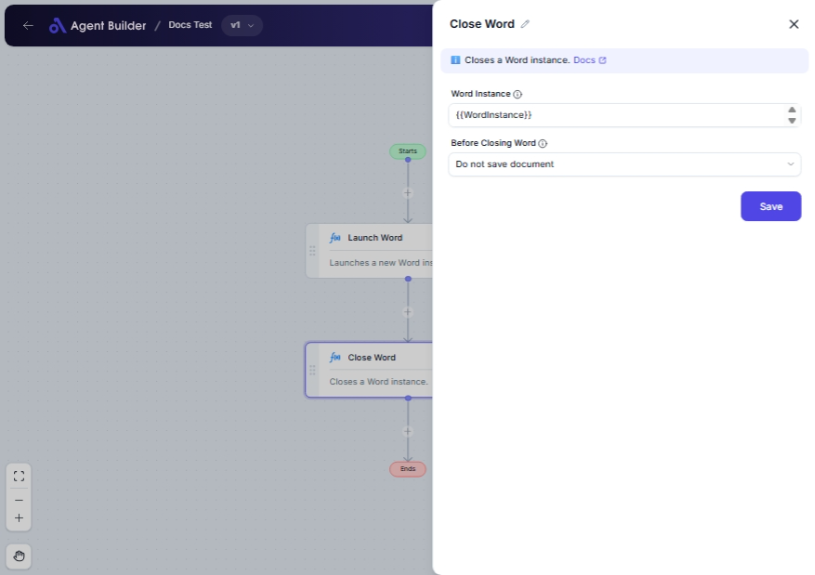

import { Callout, Steps } from "nextra/components";

# Close Word

The **Close Word** node is used to terminate a specific instance of Microsoft Word. You can choose whether to save any changes made to a document before closing. This is useful when automating tasks that include editing Word documents and you want to ensure they are properly closed, with or without saving changes, to maintain data integrity or to free up system resources.

{/*  */}

## Configuration Options

| Field Name              | Description                                           | Input Type | Required? | Default Value     |
| ----------------------- | ----------------------------------------------------- | ---------- | --------- | ----------------- |
| **Word Instance**       | The specific instance of Word that you want to close. | Text       | Yes       | _(empty)_         |
| **Before Closing Word** | Option to save the document before closing.           | Select     | No        | DoNotSaveDocument |

## Expected Output Format

This node does not directly produce an output. Instead, it performs an action by closing the specified Word instance as per the defined parameters.

## Step-by-Step Guide

<Steps>
### Step 1

Add **Close Word** node into your flow.

### Step 2

In the **Word Instance** field, enter the identifier for the Word instance you wish to close. This is required.

### Step 3

In the **Before Closing Word** dropdown, choose an option for how to handle any unsaved document:

- **Do not save document**: Closes the document without saving.
- **Save document**: Saves the current document before closing.
- **Save document as**: Allows you to save the document under a new name before closing.

</Steps>

<Callout type="info" title="Note">
  The **Before Closing Word** option defines how changes to open documents are
  handled, which can prevent loss of unsaved work.
</Callout>

## Input/Output Examples

| Word Instance | Before Closing Word  | Action Taken                                                                   |
| ------------- | -------------------- | ------------------------------------------------------------------------------ |
| word1         | Do not save document | Closes the document associated with "word1" without saving any changes made.   |
| word2         | Save document        | Saves any changes made to the document associated with "word2" before closing. |
| word3         | Save document as     | Saves the document associated with "word3" under a new name before closing.    |

## Common Mistakes & Troubleshooting

| Problem                         | Solution                                                                                                                        |
| ------------------------------- | ------------------------------------------------------------------------------------------------------------------------------- |
| **Word Instance not specified** | Ensure you enter a valid Word instance identifier in the **Word Instance** field.                                               |
| **Document changes are lost**   | Always select an appropriate save option in the **Before Closing Word** dropdown to prevent accidental loss of unsaved changes. |
| **Unexpected closing behavior** | Double-check the save options to ensure the document is handled as expected before the Word instance closes.                    |

## Real-World Use Cases

- **Automated Document Editing**: Close Word application after a series of automated edits to free up system resources.
- **Document Workflow Management**: Ensure documents are saved under new versions before closing in a document management workflow.
- **Scheduled Downtime**: Automatically close Word applications to prepare for system maintenance or updates.
