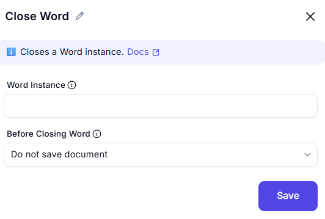

# Close Word  

This feature allows users to close a Word document or instance with options to save or discard changes. It is useful for ensuring that Word instances are properly closed after automation tasks.  

  

## Configuration Options

### Word Instance
- **Description**: Select the Word instance (document) to close.  
- **Purpose**: This ensures the action is performed on the correct document.  

### Before Closing Word
- **Description**: Choose what to do before closing the document:  
  - **Do not save document**: Close the document without saving changes.  
  - **Save document**: Save changes before closing.  
- **Purpose**: This ensures the document is handled according to the desired behavior.  
  
## Use Cases
- **Closing Documents**: Closing a Word document after completing automation tasks.  
- **Saving Changes**: Saving changes to a document before closing it.  
- **Resource Cleanup**: Ensuring Word instances are properly closed to free up system resources.  

## Summary
The **Close Word** action provides a way to close a Word document with customizable options, including saving changes, document format, and file path. It ensures proper cleanup and resource management after automation tasks.