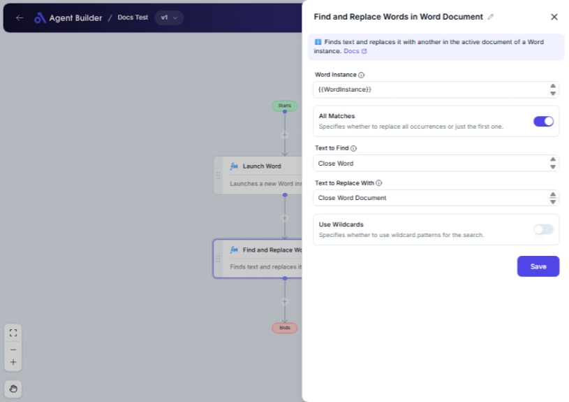

import { Callout, Steps } from "nextra/components";

# Find and Replace Words in Word Document

The **Find and Replace Words in Word Document** node is designed to streamline your document editing tasks by enabling you to locate specific words or phrases within a Word document and replace them with desired alternatives. This functionality can be beneficial for making quick edits across a document, ensuring consistency, or updating text based on new information.

You might use this node for:

- Appropriately altering terms or phrases throughout a document.
- Rapidly updating multiple instances of a word or phrase.
- Maintaining uniformity in terminology across large documents.

## Configuration Options

| Field Name                 | Description                                                         | Input Type | Required? | Default Value |
| -------------------------- | ------------------------------------------------------------------- | ---------- | --------- | ------------- |
| **Word Instance**          | The specific Word instance to use.                                  | Text       | Yes       | _(empty)_     |
| **All Matches**            | Specifies whether to replace all occurrences or just the first one. | Switch     | No        | False         |
| **Text to Find**           | The text to search for in the document.                             | Text       | Yes       | _(empty)_     |
| **Text to Replace With**   | The text to replace the found text with.                            | Text       | Yes       | _(empty)_     |
| **Use Wildcards**          | Specifies whether to use wildcard patterns for the search.          | Switch     | No        | False         |
| **Match Case**             | Specifies whether the search should be case-sensitive.              | Switch     | No        | True          |
| **Match Whole Words Only** | Specifies whether to match whole words only.                        | Switch     | No        | True          |

## Expected Output Format

The output of this node does not return a value visibly. Instead, it performs the replacement operation within the provided Word instance, making changes directly to your document.

## Step-by-Step Guide

<Steps>
### Step 1

Add the **Find and Replace Words in Word Document** node into your flow.

### Step 2

In the **Word Instance** field, specify the Word document instance you want to modify.

### Step 3

Enter the text you want to search for in the **Text to Find** field.

### Step 4

In the **Text to Replace With** field, input the text you want to replace the found text with.

### Step 5

Toggle the **All Matches** switch if you want to replace all occurrences of the text within the document.

### Step 6

If you need to use wildcard characters in the search, toggle the **Use Wildcards** switch. This will allow you to activate additional options:

- **Match Case**: Ensures the search is case-sensitive.
- **Match Whole Words Only**: Only replaces whole words that match the search.

### Step 7

Review your settings and execute the node to perform the find and replace operation within the document.

</Steps>

<Callout type="info" title="Note">
  Enabling the **Use Wildcards** option activates the **Match Case** and **Match
  Whole Words Only** switches, giving you more control over the search
  parameters.
</Callout>

## Input/Output Examples

While there is no direct output value, an example scenario might involve:

- **Text to Find**: "obsolete term"
- **Text to Replace With**: "updated term"
- **All Matches**: Yes
- **Use Wildcards**: No
- Result: All instances of "obsolete term" within the Word document are replaced with "updated term".

## Common Mistakes & Troubleshooting

| Issue                                                   | Solution                                                                                                        |
| ------------------------------------------------------- | --------------------------------------------------------------------------------------------------------------- |
| **Nothing is replaced in the document**                 | Verify that the text in **Text to Find** matches exactly what is in the document, including case if applicable. |
| **Unexpected matches when using wildcards**             | Check your wildcard patterns and ensure they accurately reflect your intended search criteria.                  |
| **Match Case and Match Whole Words Only not appearing** | Ensure **Use Wildcards** is enabled to see these options.                                                       |

## Real-World Use Cases

- **Company Rebranding**: Change outdated branding terms to new ones across company documentation.
- **Policy Updates**: Quickly update policy documents by replacing old terminologies with new standards.
- **Consistency Maintenance**: Ensure all variations of terms in a document conform to an agreed-upon usage, particularly in large-scale documents.
