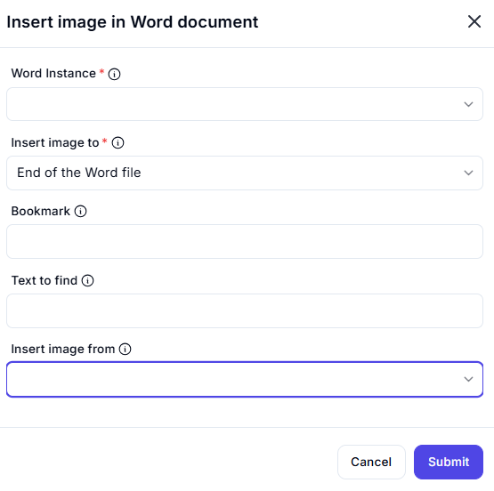

# Insert Image in Word Document  

This feature allows users to insert an image into a Word document at a specified location, such as the end of the document, a bookmark, or after specific text. It is useful for adding visuals to documents during automation workflows.  

  

## Configuration Options

### Word Instance
-  Select the Word instance (document) where the image will be inserted.  
This ensures the action is performed on the correct document.  

### Insert Image To
-  Choose where to insert the image in the document:  
  - **End of the Word File**: Insert the image at the end of the document.  
  - **Bookmark**: Insert the image at a specific bookmark.  
  - **Text to Find**: Insert the image after specific text in the document.  
 This ensures the image is inserted at the desired location.  

### Insert Image From
-  Specify the file path or source of the image to insert.  
 This ensures the correct image is inserted into the document.  

### Image path
-  Specify the file path or source of the image to insert.  
 This ensures the correct image is inserted into the document.  

## Use Cases
- **Document Enhancement**: Adding images to Word documents for visual appeal or reference.  
- **Automated Reporting**: Inserting charts, graphs, or logos into reports.  
- **Bookmark Integration**: Placing images at predefined bookmarks for structured document updates.  

## Summary
The **Insert Image in Word Document** action provides a way to insert an image into a Word document at a specified location, such as the end of the document, a bookmark, or after specific text. It ensures precise image placement, making it ideal for document enhancement and automation workflows.