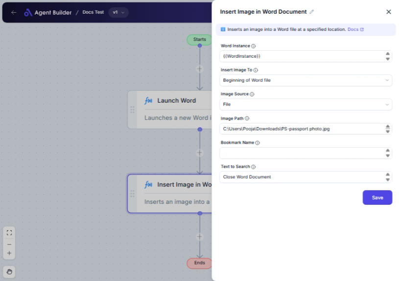

import { Callout, Steps } from "nextra/components";

# Insert Image in Word Document

The **Insert Image in Word Document** node allows you to insert an image into a Microsoft Word document easily. This is helpful when you need to add images for illustrations, branding, or documentation purposes directly into your Word files.

You can choose where in the document the image is inserted—such as at the beginning or end of the document, or near specific bookmarks or text.

{/*  */}

## Configuration Options

| Field Name          | Description                                                               | Input Type | Required? | Default Value |
| ------------------- | ------------------------------------------------------------------------- | ---------- | --------- | ------------- |
| **Word Instance**   | Specifies the Word document to which the image will be inserted.          | Text       | Yes       | _(empty)_     |
| **Insert Image To** | Determines where in the Word document to place the image.                 | Select     | Yes       | EndOfWordFile |
| **Image Source**    | Indicates whether the image comes from a file path or the clipboard.      | Select     | Yes       | File          |
| **Image Path**      | The location of the image file on your computer if selecting from a file. | Text       | Yes       | _(empty)_     |
| **Bookmark Name**   | Specifies the name of the bookmark if inserting before/after a bookmark.  | Text       | No        | _(empty)_     |
| **Text to Search**  | The specific text to locate if inserting before or after a text string.   | Text       | No        | _(empty)_     |

## Expected Output Format

This node performs an action within a Word document and does not produce an output value directly viewable in the platform. The result is an **updated Word document** with the inserted image.

## Step-by-Step Guide

<Steps>
### Step 1

Add the **Insert Image in Word Document** node into your workflow.

### Step 2

In the **Word Instance** field, enter the reference for the Word document you wish to update.

### Step 3

Select the desired location for the image placement in the **Insert Image To** dropdown. Options include beginning or end of the document, or near specified bookmarks or text.

### Step 4

Choose the **Image Source**. Select "File" if inserting from a local file path, or "Clipboard" to use an image from your clipboard.

### Step 5

If **File** is selected in the Image Source, provide the path in the **Image Path** field.

### Step 6

If insert location involves bookmarks or specific text, fill in the **Bookmark Name** or **Text to Search** fields as necessary.

### Step 7

The selected image will be inserted into the document at the specified location.

</Steps>

<Callout type="info" title="Tip">
  Ensure the Word instance is correctly set and available; otherwise, the image
  insertion will not be successful.
</Callout>

## Input/Output Examples

- **File Source & Document End**: Insert an image named "logo.png" located in `C:\Images\` at the end of the Word document.
- **Clipboard Source & Bookmark**: Insert an image copied to clipboard before the bookmark "Introduction".

## Common Mistakes & Troubleshooting

| Problem                                     | Solution                                                                  |
| ------------------------------------------- | ------------------------------------------------------------------------- |
| **Word Instance not recognized**            | Confirm the instance name matches the active Word document.               |
| **Image not found**                         | Check if the file path is correct and the file is accessible.             |
| **Text or bookmark search not functioning** | Verify the spelling and presence of the bookmark or text in the document. |
| **Image not inserted from clipboard**       | Ensure the clipboard contains an image format recognized by Word.         |

## Real-World Use Cases

- **Company Reports**: Automatically insert graphs and charts into corporate reports to enhance data presentation.
- **Marketing Documents**: Add product images into brochures and promotional materials without manual editing.
- **Personalized Letters**: Insert scanned signatures from the clipboard for customized communication.
