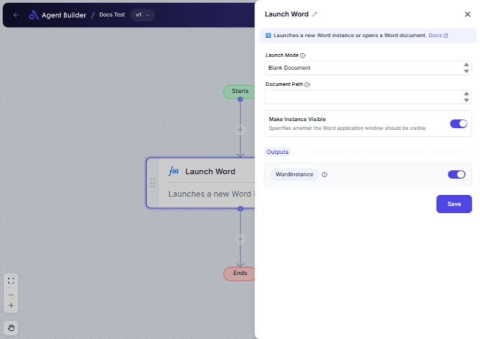

import { Callout, Steps } from "nextra/components";

# Launch Word

The **Launch Word** node is designed to help you start Microsoft Word directly from your workflow. You can either open a new blank document for immediate use or open an existing document for review or editing. This functionality is particularly useful when you need to automate document preparation or editing tasks as part of a larger automated process.

For example:

- Start a new Word document automatically when processing reports.
- Open an existing document for an automated batch edit.
- Ensure specific Word documents are used in automation workflows.

{/*  */}

## Configuration Options

| Field Name                | Description                                                                             | Input Type | Required? | Default Value  |
| ------------------------- | --------------------------------------------------------------------------------------- | ---------- | --------- | -------------- |
| **Launch Mode**           | Choose whether Word starts with a blank document or opens an existing one.              | Text       | No        | Blank Document |
| **Document Path**         | Enter the path if you want to open an existing document. Required for opening existing. | Text       | No        | _(empty)_      |
| **Make Instance Visible** | Decide if Word should be visible when launched.                                         | Switch     | No        | True           |

## Expected Output Format

The node outputs a **Word Instance** used for further Word operations. This identifies Word for other automation tasks involving Word documents.

- When launching Word, you get an instance key (like `WordInstance`) that denotes the specific session. This is crucial when multiple documents are managed.

## Step-by-Step Guide

<Steps>
### Step 1

Add the **Launch Word** node to your flow.

### Step 2

In the **Launch Mode** field, select from the dropdown:

- **Blank Document**: Opens a new blank document.
- **Open Existing Document**: Opens a specified document.

### Step 3

If you choose **Open Existing Document**, provide the **Document Path** for the file you need to open.

### Step 4

Toggle the **Make Instance Visible** switch to set whether you want the Word interface visible or not.

### Step 5

The launched Word service will output a **Word Instance** for use in subsequent nodes handling document operations.

</Steps>

<Callout type="info" title="Note">
  You must specify a **Document Path** if you select "Open Existing Document".
</Callout>

## Input/Output Examples

| Launch Mode            | Document Path          | Make Instance Visible | Output Value | Output Type   |
| ---------------------- | ---------------------- | --------------------- | ------------ | ------------- |
| Blank Document         | _(n/a)_                | True                  | WordInstance | Word Instance |
| Open Existing Document | /path/to/document.docx | False                 | WordInstance | Word Instance |

## Common Mistakes & Troubleshooting

| Problem                                  | Solution                                                  |
| ---------------------------------------- | --------------------------------------------------------- |
| **Word not opening**                     | Verify Microsoft Word is installed and accessible.        |
| **Document Path not functioning**        | Ensure the correct file path is specified and accessible. |
| **Switch makes application non-visible** | Check the **Make Instance Visible** toggle settings.      |

## Real-World Use Cases

- **Drafting Memos**: Automatically open a blank document for taking notes during meetings.
- **Batch Processing**: Open multiple documents in sequence for batch modifications or data extraction.
- **Workflow Integration**: Launch a document for data entry after processing data in other systems.
