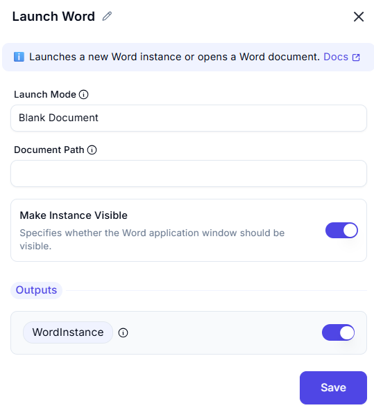

# Launch Word  

This feature allows users to launch Microsoft Word, either with a blank document or by opening an existing document. It includes options to control visibility, read-only mode, and advanced settings.  

  

## Configuration Options 

### 1. Launch Mode
-  Choose how to launch Microsoft Word:  
  - **With a blank document**: Open Word with a new, blank document.  
  - **Document path**: Open Word with an existing document by specifying its file path.  
- This ensures Word is launched with the desired document or a blank file.  

### Document path
  -  The file path of the document to open. Required if 'Launch Mode' is 'Open Existing Document'.
  - This ensures the Word instance or document can be used in subsequent actions.  

### Make Instance Visible
- Specify whether to make the Word window visible or hide it.  
  - **Enabled**: Make the Word window visible.  
  - **Disabled**: Hide the Word window.  
- This controls the visibility of the Word instance during automation.  

### **Output**   
-  Retrieve the Word instance or document object for further use in the workflow.  
- This ensures the Word instance or document can be used in subsequent actions.  

## Use Cases  
- **Document Creation**: Launching Word with a blank document for creating new files.  
- **Document Editing**: Opening existing documents for editing or processing.  
- **Workflow Automation**: Integrating Word launch into larger automation workflows.  

## Summary  
The **Launch Word** action provides a way to launch Microsoft Word with customizable options like document path, visibility, read-only mode, and advanced settings. It ensures seamless integration of Word into automation workflows, enabling efficient document handling and processing.