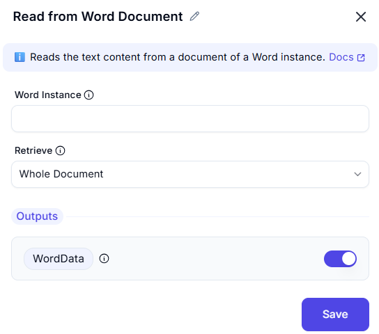

# Read from Word Document  

This feature allows users to retrieve content from a Word document, such as the entire document or specific sections. It is useful for extracting text or data from Word documents for further processing or analysis.  

  

## Configuration Options

### Word Instance
-  Select the Word instance (document) from which to retrieve content.  
- This ensures the action is performed on the correct document.  

### Retrieve
-  Choose what to retrieve from the document:  
  - **Whole Document**: Retrieve the entire content of the document.  
  - **Specific Section**: Retrieve a specific section or range of the document.  
- This ensures the desired content is retrieved.  

### Output: WordData
-  Retrieves the value of the retrieved content (e.g., text, data).  
- This provides the extracted content for further use in the workflow.  

## Use Cases
- **Text Extraction**: Extracting text from Word documents for analysis or processing.  
- **Data Retrieval**: Retrieving specific sections of a document for further use.  
- **Workflow Automation**: Integrating document content retrieval into larger workflows.  

## Summary
The **Read from Word Document** action provides a way to retrieve content from a Word document, such as the entire document or specific sections. It ensures accurate extraction of text or data, making it ideal for automation workflows involving Word documents.