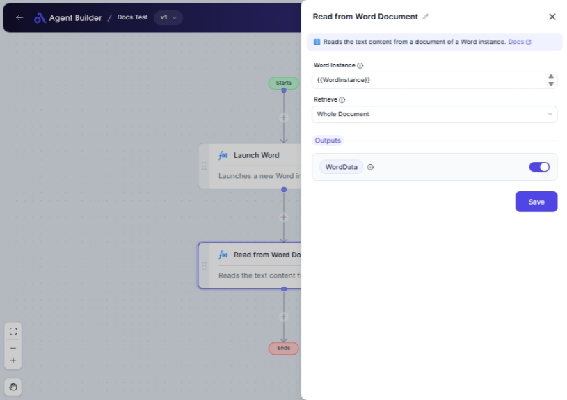

import { Callout, Steps } from "nextra/components";

# Read from Word Document

The **Read from Word Document** node allows you to extract content from Microsoft Word files in your workflow automation. This node is particularly useful when you need to process or analyze textual content from Word files, whether it involves retrieving full documents, specific pages, or content marked by bookmarks.

For example:

- Extracting entire document text for review or further processing.
- Pulling specific sections, such as certain pages, for targeted analysis.
- Collecting content marked by bookmarks for data extraction or reporting.

{/*  */}

## Configuration Options

| Field Name        | Description                                        | Input Type | Required? | Default Value |
| ----------------- | -------------------------------------------------- | ---------- | --------- | ------------- |
| **Word Instance** | The specific Word instance to read from.           | Text       | Yes       | _(empty)_     |
| **Retrieve**      | Specifies the portion of the document to retrieve. | Select     | No        | WholeDocument |

## Expected Output Format

The output of this node is **textual content** extracted from the specified portion of the Word document. This content can be either the whole document, specified pages, or content within bookmarks.

- If retrieving the whole document: all text content is extracted.
- If retrieving specific pages: text from those pages only is extracted.
- If retrieving content by bookmark: only the text within the specific bookmark is extracted.

## Step-by-Step Guide

<Steps>
### Step 1

Add **Read from Word Document** node into your flow.

### Step 2

In the **Word Instance** field, enter the specific instance of the Word document you wish to read.

### Step 3

In the **Retrieve** dropdown, select how you want to extract the content from the document:

- **Whole Document**: Retrieves the entire content of the document.
- **Pages**: Retrieves content based on specified page numbers.
- **Bookmark**: Retrieves content located within a specific bookmark.

### Step 4

Connect the output labeled as **Word Data** to another node where you wish to use the retrieved content.

</Steps>

<Callout type="info" title="Tip">
  If you select "Pages" or "Bookmark" in the **Retrieve** dropdown, ensure you
  have the necessary page numbers or bookmark name ready for accurate
  extraction.
</Callout>

## Input/Output Examples

| Retrieve Option | Input Description             | Output Example                                 | Output Format |
| --------------- | ----------------------------- | ---------------------------------------------- | ------------- |
| Whole Document  | Retrieve all document content | "Lorem ipsum dolor sit..."                     | Text          |
| Pages           | Pages: 2, 3, 4                | "Page 2 text... Page 3 text... Page 4 text..." | Text          |
| Bookmark        | Bookmark: "SummarySection"    | "This section summarizes key points..."        | Text          |

## Common Mistakes & Troubleshooting

| Problem                                   | Solution                                                                                                          |
| ----------------------------------------- | ----------------------------------------------------------------------------------------------------------------- |
| **Error in specifying Word Instance**     | Ensure that the Word Instance address or identification is correctly supplied.                                    |
| **Retrieve option not working correctly** | Double-check that page numbers or bookmarks are accurately identified in the Word document.                       |
| **Output is empty**                       | Verify that the specified content (pages, bookmarks) contains textual content and that it's correctly referenced. |

## Real-World Use Cases

- **Content Reviews**: Extract full documents or segments like executive summaries for content analysis.
- **Page-Specific Analysis**: Retrieve financial reports from specified pages in large documents for processing.
- **Bookmark-Based Extraction**: Use bookmarks to isolate and pull sections like "Terms and Conditions" from legal documents.
