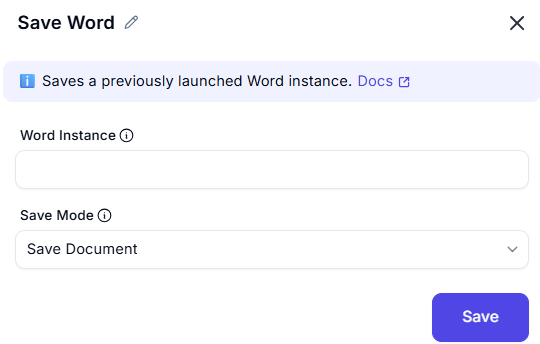

# Save Word  

## Description
This feature allows users to save a Word document with specific options, such as the save mode, document format, and file path. It is useful for ensuring that changes to a document are saved correctly and in the desired format.  

  

## Fields and Options  

### 1. Word Instance
- **Description**: Select the Word instance (document) to save.  
- **Purpose**: This ensures the action is performed on the correct document.  

### 2. Save Mode
- **Description**: Choose how the document should be saved:  
  - **Save Document**: Save changes to the document.  
  - **Save As**: Save the document with a new name or format.  
- **Purpose**: This ensures the document is saved according to the desired mode.  

## Use Cases  
- **Saving Changes**: Saving changes to a Word document after editing.  
- **Exporting Documents**: Saving a document in a specific format (e.g., `.docx`, `.pdf`).  
- **Workflow Automation**: Including document saving as part of larger automation workflows.  

## Summary
The **Save Word** action provides a way to save a Word document with customizable options, including save mode, document format, and file path. It ensures that document changes are preserved and stored in the desired format and location.