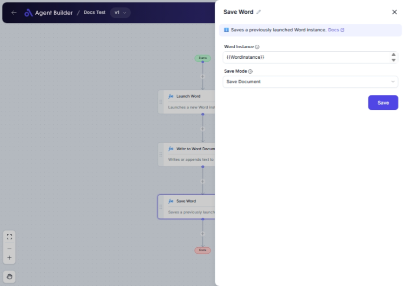

import { Callout, Steps } from "nextra/components";

# Save Word

The **Save Word** node is designed to save a Microsoft Word document that you are currently working on. This node is useful when you need to automate the saving process of an open Word document, ensuring that your changes are not lost and can be retrieved later. It's particularly helpful when managing multiple documents or automating repetitive tasks in Word.

For example:

- Automatically save a document in progress to prevent data loss.
- Save a copy of a document under a new name or location.

{/*  */}

## Configuration Options

| Field Name        | Description                                                          | Input Type | Required? | Default Value |
| ----------------- | -------------------------------------------------------------------- | ---------- | --------- | ------------- |
| **Word Instance** | The specific Word document instance you want to save.                | Text       | Yes       | _(empty)_     |
| **Save Mode**     | Choose how to save the document: existing name or new name/location. | Select     | No        | SaveDocument  |

## Expected Output Format

The output from this node signifies a successful save operation and does not produce additional data. Instead, it returns a confirmation status indicating the document has been saved successfully.

## Step-by-Step Guide

<Steps>
### Step 1

Add the **Save Word** node to your automation flow.

### Step 2

In the **Word Instance** field, enter the identifier for the Word document you want to save. This ensures the correct document is targeted.

### Step 3

In the **Save Mode** dropdown, select how you wish to save the document:

- **Save Document**: Saves the current document under its existing name and location.
- **Save Document As**: Allows you to specify a new name or location for the document.

</Steps>

<Callout type="info" title="Tip">
  Use the **Save Document As** option if you need to create separate versions of
  a document or save in a different location.
</Callout>

## Input/Output Examples

| Save Mode        | Word Instance | Result                  |
| ---------------- | ------------- | ----------------------- |
| Save Document    | "Doc1"        | Document "Doc1" saved.  |
| Save Document As | "Doc1"        | Save dialog for "Doc1". |

## Common Mistakes & Troubleshooting

| Problem                                         | Solution                                                                                     |
| ----------------------------------------------- | -------------------------------------------------------------------------------------------- |
| **Word Instance field is empty**                | Ensure that you input the correct instance identifier of the Word document you want to save. |
| **Document not saving under new name/location** | Verify that you selected **"Save Document As"** and provide the necessary name/location.     |

## Real-World Use Cases

- **Automated Document Management**: Save drafts automatically at regular intervals to avoid manual saving.
- **Version Control**: Save documents under different names to maintain versions history.
- **Project Documentation**: Automatically save project documentation updates in specified locations.
