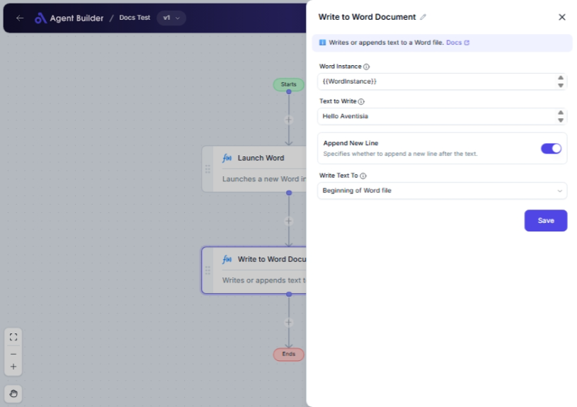

import { Callout, Steps } from "nextra/components";

# Write to Word Document

The **Write to Word Document** node lets you add or append text to a Microsoft Word document. This node is helpful when you need to update existing documents with new information, such as adding notes, comments, or continuous updates without manually opening the Word files.

For example:

- Appending meeting minutes to an ongoing Word document.
- Adding dynamic content to pre-existing templates.
- Automatically documenting changes or memos at specific points in your Word files.

## Configuration Options

| Field Name          | Description                                                                   | Input Type | Required? | Default Value          |
| ------------------- | ----------------------------------------------------------------------------- | ---------- | --------- | ---------------------- |
| **Word Instance**   | The specific Word instance to use.                                            | Text       | Yes       | _(empty)_              |
| **Text to Write**   | The text to be written or appended to the Word document.                      | Text       | Yes       | _(empty)_              |
| **Append New Line** | Specifies whether to append a new line after the text.                        | Switch     | No        | True                   |
| **Write Text To**   | Specifies the location in the Word document where the text should be written. | Select     | No        | Beginning of Word file |

## Expected Output Format

This node does not produce an output to use in subsequent nodes. Its effect is directly on the specified Word document by updating or adding the text within the file.

## Step-by-Step Guide

<Steps>
### Step 1

Add **Write to Word Document** node into your flow.

### Step 2

In the **Word Instance** field, specify the Word instance you wish to write to. Ensure this instance is correctly opened and accessible.

### Step 3

Enter the text you wish to add in the **Text to Write** field.

### Step 4

Use the **Append New Line** switch to decide if the text should end with a new line. Turn it on to start any subsequent text on a new line.

### Step 5

Choose where in the document you want the text written by using the **Write Text To** dropdown menu. Options include:

- **Beginning of Word file**: Adds text at the top of the document.
- **End of Word file**: Places text at the document's end.
- **Before Bookmark**: Puts text before a given bookmark.
- **After Bookmark**: Inserts text after a specific bookmark.

### Step 6

Confirm and apply settings. Your text is now added to the Word document at the specified location.

</Steps>

<Callout type="info" title="Note">
  If you select "Before Bookmark" or "After Bookmark" in the **Write Text To**
  dropdown, ensure the bookmarks are defined in the Word document; otherwise,
  this function may not execute as expected.
</Callout>

## Input/Output Examples

_Input Scenario_:

- **Word Instance**: A Word file named `MeetingNotes.docx`.
- **Text to Write**: "Today's meeting highlights include project deadlines and assigned tasks."
- **Append New Line**: Yes
- **Write Text To**: End of Word file

_Result_:

- Text "Today's meeting highlights include project deadlines and assigned tasks." will be appended at the end of `MeetingNotes.docx`, followed by a new line.

## Common Mistakes & Troubleshooting

| Problem                              | Solution                                                                                                                                          |
| ------------------------------------ | ------------------------------------------------------------------------------------------------------------------------------------------------- |
| **Text not appearing in document**   | Ensure the Word instance is correct and the document is accessible. Double-check if file permissions allow writing.                               |
| **Bookmark option not working**      | Verify the existence of bookmarks within your document before selecting "Before Bookmark" or "After Bookmark".                                    |
| **Text appearing in wrong location** | Double-check the selection in **Write Text To** dropdown to ensure the text is placed correctly. Be aware of any pre-existing content formatting. |

## Real-World Use Cases

- **Weekly Reports**: Automatically add weekly summaries to a Word report template stored on a shared drive.
- **Personalized Letters**: Insert client-specific information in predefined Word template positions, enhancing personal communication.
- **Document Record Keeping**: Append logs of automated checks and balance tasks to documentation for better record-keeping and transparency.
