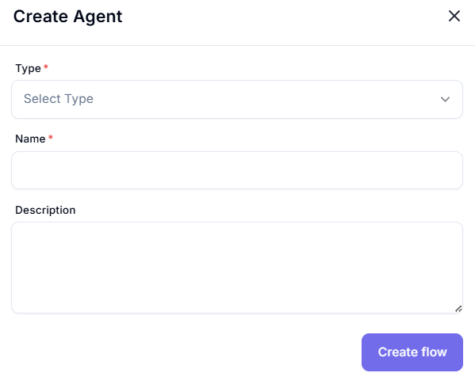

# Create Agent

## Description

This image depicts a user interface form titled "Create Agent." The form is designed for creating a new agent, likely within a software application or platform. Below is a detailed breakdown of the elements present in the form:

## Header Section
- **Title**: "Create Agent"
  - The title is displayed at the top of the form in a bold, dark font.
- **Close Button**: 
  - A small "X" button is located at the top-right corner of the form, allowing the user to close the form.

## Form Fields
The form contains three main input fields, each with specific labels and characteristics:

1. **Type Field**:
   - **Label**: "Type *"
     - The label "Type" is followed by a red asterisk (*), indicating that this field is required.
   - **Input Type**: Dropdown menu
     - The dropdown menu is currently set to a placeholder text, "Select Type," with a downward arrow on the right side, indicating that it can be expanded to show options.
   - **Styling**: The dropdown field has a light gray border and a white background.

2. **Name Field**:
   - **Label**: "Name *"
     - Similar to the "Type" field, the label "Name" is followed by a red asterisk (*), indicating that this field is mandatory.
   - **Input Type**: Text input
     - This is a single-line text input field, currently empty, allowing the user to type in the agent's name.
   - **Styling**: The text field has a light gray border and a white background, matching the style of the "Type" dropdown.

3. **Description Field**:
   - **Label**: "Description"
     - Unlike the previous fields, this label does not have an asterisk, suggesting that this field is optional.
   - **Input Type**: Text area
     - This is a larger, multi-line text area where the user can enter a detailed description of the agent.
     - The text area includes a small resize handle (diagonal lines) at the bottom-right corner, indicating that the user can adjust its size.
   - **Styling**: The text area has a light gray border and a white background, consistent with the other fields.

## Action Button
- **Button**: "Create flow"
  - Located at the bottom-right of the form, there is a button labeled "Create flow."
