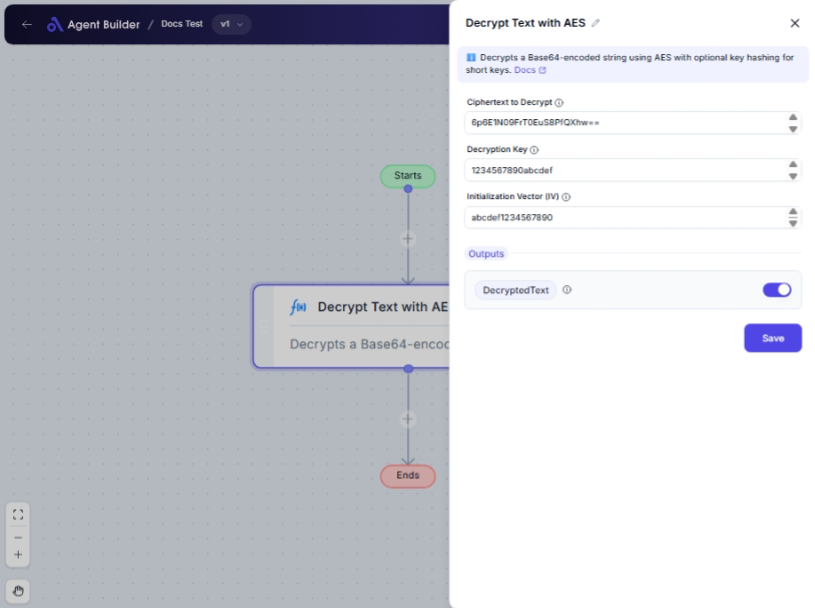

import { Callout, Steps } from "nextra/components";

# Decrypt Text with AES

The **Decrypt Text with AES** node is designed to transform encrypted text (ciphertext) back into its original form using the AES (Advanced Encryption Standard) encryption scheme. This node is particularly useful for securely handling encrypted information and is commonly used in data security processes.

AES is a widely recognized encryption standard known for its strength and efficiency in data protection. By using this node, you can decrypt sensitive information when you have the appropriate key and initialization vector.

{/*  */}

## Configuration Options

| Field Name                | Description                                                          | Input Type | Required? | Default Value |
| ------------------------- | -------------------------------------------------------------------- | ---------- | --------- | ------------- |
| **Ciphertext to Decrypt** | Enter the ciphertext that you want to decrypt.                       | Text       | Yes       | _(empty)_     |
| **Decryption Key**        | Enter the key used for decrypting the ciphertext.                    | Text       | Yes       | _(empty)_     |
| **Initialization Vector** | Enter the initialization vector (IV) used in the decryption process. | Text       | Yes       | _(empty)_     |

## Expected Output Format

The output of this node is plain **text**, representing the decrypted version of the input ciphertext.

## Step-by-Step Guide

<Steps>
### Step 1

Add the **Decrypt Text with AES** node into your flow.

### Step 2

In the **Ciphertext to Decrypt** field, enter the encrypted text that you need to convert back to its original form.

### Step 3

Provide the **Decryption Key**. This key must match the one used during the encryption process to successfully decrypt the text.

### Step 4

Enter the **Initialization Vector** (IV). The IV used must be the same as the one applied when the text was encrypted.

### Step 5

The decrypted text will be available through the **DecryptedText** output for further processing or display.

</Steps>

<Callout type="info" title="Important">
  Ensure the Decryption Key and Initialization Vector are kept secure and
  confidential, as they are crucial for the security of the decryption process.
</Callout>

## Input/Output Examples

| Ciphertext           | Decryption Key  | Initialization Vector | Output Value | Output Type |
| -------------------- | --------------- | --------------------- | ------------ | ----------- |
| U2FsdGVkX19VvXx1AaM= | mySecretKey123! | ivExample987!         | Hello World  | Text        |

## Common Mistakes & Troubleshooting

| Problem                             | Solution                                                                                       |
| ----------------------------------- | ---------------------------------------------------------------------------------------------- |
| **Incorrect Ciphertext Entry**      | Verify that the ciphertext is complete and accurately copied from the source.                  |
| **Mismatched Key or IV**            | Ensure the Decryption Key and Initialization Vector are the exact ones used during encryption. |
| **Unexpected Characters in Output** | Check all fields for correct entries. The key/IV might be incorrect or improperly formatted.   |

## Real-World Use Cases

- **Securely Retrieve User Data**: Decrypt sensitive data like passwords or personal information stored in databases.
- **Secure Communication**: Ensure messages are decrypted correctly on receipt, maintaining privacy in communications.
- **Data Protection Compliance**: Use in processes requiring strong encryption/decryption for regulatory compliance.
