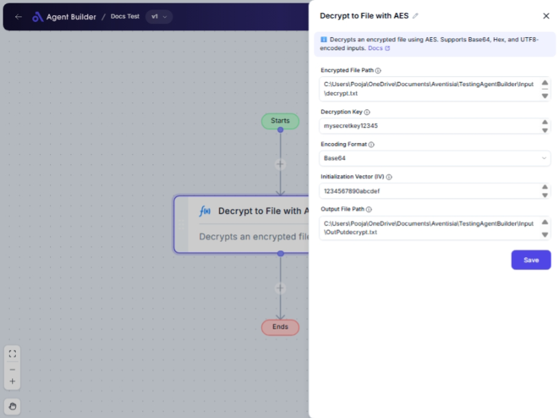

import { Callout, Steps } from "nextra/components";

# Decrypt to File with AES

The **Decrypt to File with AES** node provides you with the ability to securely decrypt an encrypted file using the AES (Advanced Encryption Standard) method. This is particularly useful when you need to retrieve the original content from an encrypted file for processing, analysis, or storage.

For example:

- Decrypting confidential data files for access and review.
- Restoring encrypted backup files to their original state.
- Accessing encrypted documents which require secure storage.

## Configuration Options

| Field Name              | Description                                   | Input Type | Required? | Default Value |
| ----------------------- | --------------------------------------------- | ---------- | --------- | ------------- |
| **Encrypted File Path** | The path to the encrypted file.               | Text       | Yes       | _(empty)_     |
| **Key**                 | The decryption key.                           | Text       | Yes       | _(empty)_     |
| **Encoding Format**     | The encoding format of the encrypted content. | Select     | Yes       | _(empty)_     |
| **Output File Path**    | The path to the output file.                  | Text       | Yes       | _(empty)_     |

## Expected Output Format

The node outputs a **decrypted file** saved at the specified output file path.

## Step-by-Step Guide

<Steps>
### Step 1

Add the **Decrypt to File with AES** node into your flow.

### Step 2

In the **Encrypted File Path** field, enter the path to your encrypted file.

### Step 3

In the **Key** field, enter your decryption key. Ensure this is correct to successfully decrypt the file.

### Step 4

Select the **Encoding Format** of your encrypted content from the dropdown options:

- **Base64**: Select if the file content is base64 encoded.
- **Hex**: Select if the file content is hexadecimal encoded.
- **UTF8**: Select if the file content is UTF-8 encoded.

### Step 5

In the **Output File Path** field, specify where the decrypted file should be saved.

</Steps>

<Callout type="info" title="Tip">
  Ensure the paths entered in **Encrypted File Path** and **Output File Path**
  are correct and accessible.
</Callout>

## Input/Output Examples

| Encrypted File Path          | Key            | Encoding Format | Output File Path                    | Decrypted File                                     |
| ---------------------------- | -------------- | --------------- | ----------------------------------- | -------------------------------------------------- |
| `path/to/encrypted/file.enc` | a1B2c3D4e5F6g7 | Base64          | `path/to/output/decrypted-file.txt` | The decrypted file is saved at the specified path. |

## Common Mistakes & Troubleshooting

| Problem                         | Solution                                                                                                                          |
| ------------------------------- | --------------------------------------------------------------------------------------------------------------------------------- |
| **File not found error**        | Double-check the **Encrypted File Path** to ensure the file exists and the path is correct.                                       |
| **Incorrect decryption result** | Verify that the **Key** and **Encoding Format** are correct. Incorrect entries will result in improper decryption.                |
| **Access error on output path** | Ensure that the **Output File Path** is writable and you have the necessary permissions to save files in the specified directory. |

## Real-World Use Cases

- **Security**: Decrypt files that contain sensitive customer data for secure handling.
- **Data Recovery**: Decrypt backup files to restore original data after a system crash.
- **Document Management**: Automatically decrypt confidential documents for authorized personnel access.
