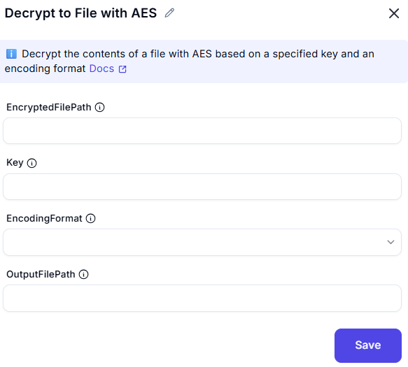

# Decrypt to File with AES

This screenshot demonstrates an interface for decrypting text and saving the decrypted content to a file using the **AES (Advanced Encryption Standard)** algorithm. Users can input the encrypted text, specify a decryption key, and configure advanced settings such as encoding, initialization vector (IV), and handling of existing files.

---

## Configuration Options

### EncryptedFilePath
- Enter the InputFilePath you want to decrypt.

### Key
- Provide the decryption key used for the AES algorithm.

### Encoding
- Select the encoding type (e.g., Unicode).
---

## OutputFilePath
- **DecryptedFile**: The resulting decrypted content saved to a file.
---

## Summary
This tool is useful for securely decrypting text and saving the decrypted content to a file using the AES algorithm. It provides options for encoding, decryption key input, and advanced settings like initialization vector and file handling for accurate decryption and file management.