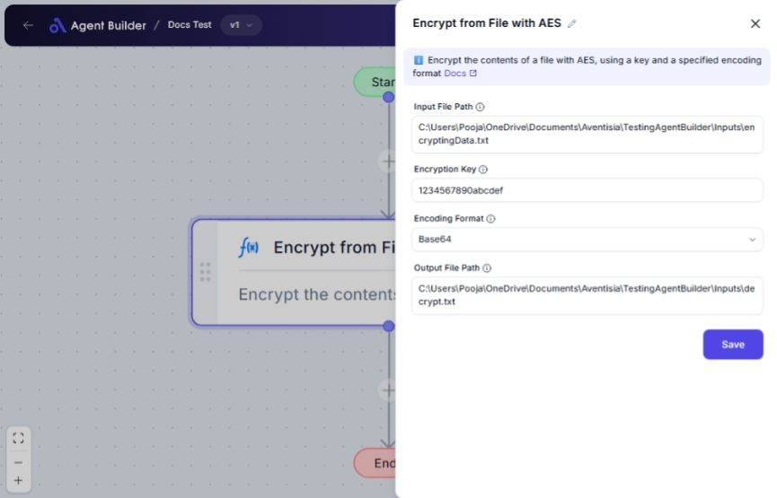

import { Callout, Steps } from "nextra/components";

# Encrypt from File with AES

The **Encrypt from File with AES** node is designed to encrypt the contents of a file using the AES encryption algorithm. AES is a widely used and secure method of encrypting data, ensuring your file remains confidential and protected from unauthorized access. You can specify the desired encoding format for the encrypted data, making it flexible for various use cases.

Examples of when to use this node include:

- Encrypting sensitive documents before sharing them with others.
- Securing files that contain personal or confidential information.

{/*  */}

## Configuration Options

| Field Name           | Description                                                   | Input Type | Required? | Default Value |
| -------------------- | ------------------------------------------------------------- | ---------- | --------- | ------------- |
| **Input File Path**  | The path to the input file.                                   | Text       | Yes       | _(empty)_     |
| **Encryption Key**   | The encryption key.                                           | Text       | Yes       | _(empty)_     |
| **Encoding Format**  | The encoding format for the encrypted content.                | Select     | Yes       | _(empty)_     |
| **Output File Path** | The path to the output file where encrypted content is saved. | Text       | Yes       | _(empty)_     |

## Expected Output Format

The output will be an **encrypted file**. The file's content will be transformed into a secure, encrypted format according to the selected encoding method.

- **Base64**: Encodes binary data using 64 different characters.
- **Hex**: Encodes data in a hexadecimal numeral system.
- **UTF8**: Encodes data in an 8-bit Unicode Transformation Format.

## Step-by-Step Guide

<Steps>
### Step 1

Add the **Encrypt from File with AES** node into your flow.

### Step 2

In the **Input File Path** field, enter the path to the file you wish to encrypt.

### Step 3

In the **Encryption Key** field, provide the secret key for encryption. Ensure that this key remains confidential and is a suitable length for AES encryption.

### Step 4

Select the desired **Encoding Format** from the dropdown list:

- **Base64** for standard encoding.
- **Hex** for hexadecimal encoding.
- **UTF8** for UTF-8 encoding.

### Step 5

Specify the **Output File Path** where the encrypted file will be saved.

### Step 6

The node will process the information and save the encrypted file to the specified output location.

</Steps>

<Callout type="warning" title="Important">
  Ensure your encryption key is stored securely and backed up. If lost, you will
  not be able to decrypt the file.
</Callout>

## Input/Output Examples

| Input File Path      | Encryption Key   | Encoding Format | Output File Path          | Result                                                              |
| -------------------- | ---------------- | --------------- | ------------------------- | ------------------------------------------------------------------- |
| `C:/docs/report.txt` | `mysecurekey123` | Base64          | `C:/encrypted/report.enc` | Encrypted file saved to `C:/encrypted/report.enc` in Base64 format. |

## Common Mistakes & Troubleshooting

| Problem                      | Solution                                                                                                      |
| ---------------------------- | ------------------------------------------------------------------------------------------------------------- |
| **File not found**           | Double-check the file path entered in **Input File Path**. Ensure the file exists and the path is correct.    |
| **Invalid encryption key**   | Make sure your **Encryption Key** meets AES requirements (e.g., length, complexity).                          |
| **Output path not writable** | Verify that the **Output File Path** is valid and writable, ensuring you have permission to save files there. |

## Real-World Use Cases

- **Document Security**: Encrypt sensitive reports or contracts before sending them via email to protect the content during transmission.
- **Data Privacy**: Secure client information files before cloud storage, maintaining privacy and compliance with regulations.
- **File Storage**: Convert sensitive data into an encrypted format for long-term storage, preventing unauthorized access.
