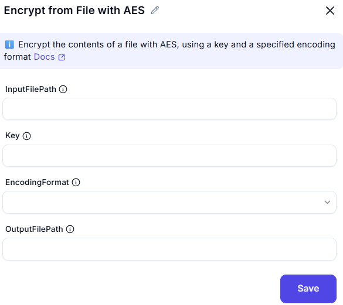

# Encrypt from File with AES

## Description
This screenshot demonstrates an interface for encrypting the contents of a file using the **AES (Advanced Encryption Standard)** algorithm. Users can select a file, specify an encryption key, and configure advanced settings such as encoding, salt, and initialization vector (IV).

## Configuration

### InputFilePath
- Choose the file you want to encrypt.

### Key
-  Provide the encryption key used for the AES algorithm.

### EncodingFormat
- Select the encoding type (e.g., Unicode).

### OutputFilePath
- The path to the output file.
---

## Summary
This tool is useful for securely encrypting file contents using the AES algorithm. It provides options for encoding, encryption key input, and advanced settings like salt and initialization vector for enhanced security.