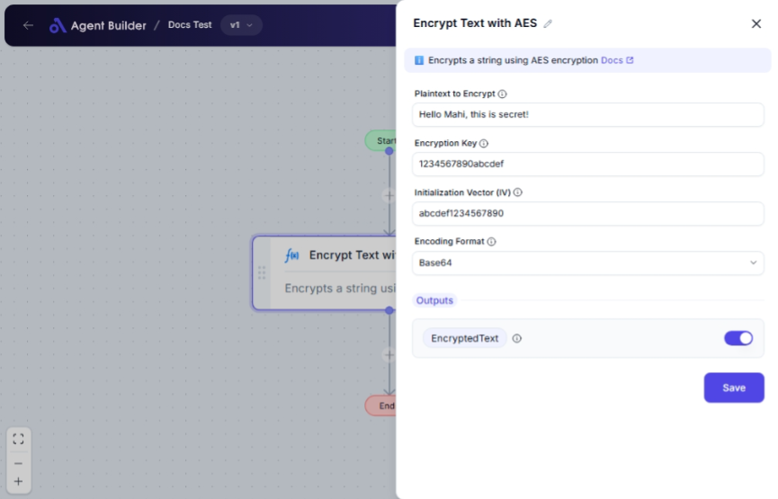

import { Callout, Steps } from "nextra/components";

# Encrypt Text with AES

The **Encrypt Text with AES** node securely encrypts text using the Advanced Encryption Standard (AES) algorithm. This node is essential for protecting sensitive data such as passwords, user information, or any confidential text by converting it into an unreadable format. This encryption is crucial in scenarios where data security and privacy are a priority, such as transmitting sensitive information over the internet.

## Configuration Options

| Field Name                     | Description                                                               | Input Type | Required? | Default Value |
| ------------------------------ | ------------------------------------------------------------------------- | ---------- | --------- | ------------- |
| **Plaintext to Encrypt**       | Enter the text you want to encrypt.                                       | Text       | Yes       | _(empty)_     |
| **Encryption Key**             | The key used for encryption. It must be exactly 32 bytes long.            | Text       | Yes       | _(empty)_     |
| **Initialization Vector (IV)** | A special value used for encryption to ensure distinct encrypted outputs. | Text       | Yes       | _(empty)_     |
| **Encoding Format**            | Select the format for the encrypted output: Base64, Hex, or UTF8.         | Select     | Yes       | _(empty)_     |

## Expected Output Format

The output is an **encrypted string** encoded in the format you select (Base64, Hex, or UTF-8). This encrypted string represents the text securely converted and unreadable to anyone without decryption rights:

- Encrypted text will be available as **EncryptedText**.

## Step-by-Step Guide

<Steps>
### Step 1

Add **Encrypt Text with AES** node into your workflow.

### Step 2

In the **Plaintext to Encrypt** field, enter the text you wish to encrypt. Ensure this is the exact text needing protection.

### Step 3

Enter the **Encryption Key**. This key must be exactly 32 bytes; any deviation will cause encryption failure.

### Step 4

Enter the **Initialization Vector (IV)**. Ensure it matches any system requirements or protocols related to data security.

### Step 5

Select your **Encoding Format** from the dropdown—either Base64, Hex, or UTF8—based on how you prefer the encrypted data to be stored or transferred.

### Step 6

The encrypted text will be displayed under **EncryptedText** within your process, ready for secure use or transmission.

</Steps>

<Callout type="warning" title="Important">
  Ensure your **Encryption Key** is exactly 32 bytes in length to avoid
  encryption errors.
</Callout>

## Input/Output Examples

| Input:                                  | Description                           |
| --------------------------------------- | ------------------------------------- |
| Plaintext: "HelloAES"                   | The text you want to encrypt.         |
| Key: "12345678901234567890123456789012" | Requires 32 byte length.              |
| IV: "1234567890123456"                  | Initialization Vector for encryption. |
| Encoding: Base64                        | The format for the encrypted result.  |

| Output:                                                     | Description                      |
| ----------------------------------------------------------- | -------------------------------- |
| EncryptedText: (example) "U2FsdGVkX1+3/qA1pVEhgPv/L2+2GG==" | Encrypted text in Base64 format. |

## Common Mistakes & Troubleshooting

| Problem                                        | Solution                                                                                                                         |
| ---------------------------------------------- | -------------------------------------------------------------------------------------------------------------------------------- |
| **"Invalid Key Length" error**                 | Ensure your **Encryption Key** is exactly 32 bytes long.                                                                         |
| **Incorrect encoding output**                  | Check that the **Encoding Format** selected is appropriate for your intended use or matches your decryption system capabilities. |
| **Varying outputs for same plaintext and key** | Verify the **Initialization Vector (IV)** is consistent if you expect identical outputs for similar inputs.                      |

## Real-World Use Cases

- **Secure Communication**: Encrypt messages or sensitive email content to protect privacy.
- **Data Storage**: Store encrypted data in databases to prevent unauthorized access.
- **Secure File Transfer**: Use for encrypting file names or contents before transferring them over networks.
- **Password Management**: Encrypt passwords for secure, encrypted storage in password managers or authentication systems.
